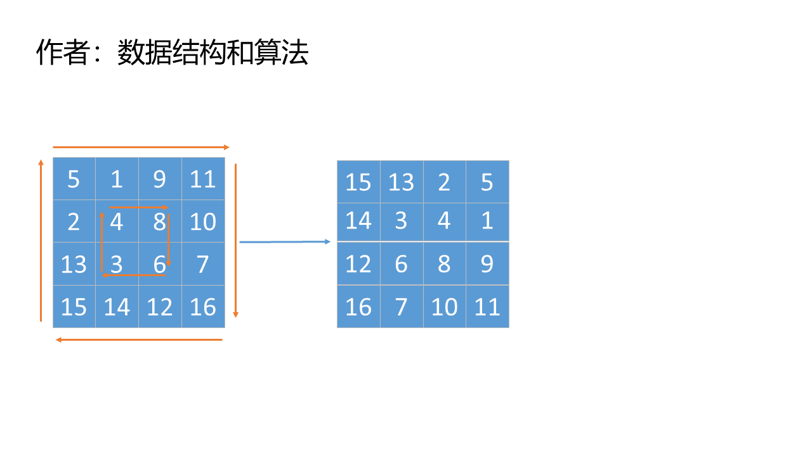

### 题目: 旋转图像
> 定一个 n × n 的二维矩阵 matrix 表示一个图像。请你将图像顺时针旋转 90 度。  
> 
>   
> 输入：matrix = [[1,2,3],[4,5,6],[7,8,9]]  
> 输出：[[7,4,1],[8,5,2],[9,6,3]] 
>  
>   
> 输入：matrix = [[5,1,9,11],[2,4,8,10],[13,3,6,7],[15,14,12,16]]
> 输出：[[15,13,2,5],[14,3,4,1],[12,6,8,9],[16,7,10,11]]
  


---
思路一:  
1.利用对称性(j和i互换)
  

思路二:
2.利用旋转的思路
  
---

```
/**
 * @param {number[][]} matrix
 * @return {void} Do not return anything, modify matrix in-place instead.
 */
var rotate = function(matrix) {
    let len = matrix.length
    // 循环前面一半的行数
    for(let j = 0; j < len / 2; j++) {
        for(let i = j; i < len - j - 1; i++) {
            let temp = matrix[j][i]
            let r = len - 1 - j
            let c = len - 1 - i
            matrix[j][i] = matrix[c][j]
            matrix[c][j] = matrix[r][c]
            matrix[r][c] = matrix[i][r]
            matrix[i][r] = temp
        }
    }
};
```

* 技巧:  

* 优化空间: 无

* 学习:  

* 总结: 
1.★二位数组旋转利用其对称性