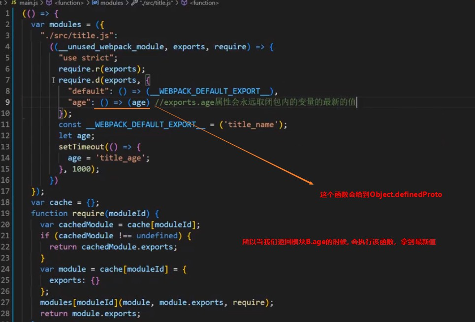

### 1.类型
```
Object.prototype.toString.call('') ;    // [object String]
Object.prototype.toString.call(1) ;     // [object Number]
Object.prototype.toString.call(true) ;  // [object Boolean]
Object.prototype.toString.call(Symbol());       //[object Symbol]
Object.prototype.toString.call(undefined) ; // [object Undefined]
Object.prototype.toString.call(null) ;      // [object Null]
Object.prototype.toString.call(new Function()) ;    // [object Function]
Object.prototype.toString.call(new Date()) ;        // [object Date]
Object.prototype.toString.call([]) ;         // [object Array]
Object.prototype.toString.call(new RegExp()) ;      // [object RegExp]
Object.prototype.toString.call(new Error()) ;       // [object Error]
// Object.prototype.toString.call(document) ;          // [object HTMLDocument]
// Object.prototype.toString.call(window) ;            //[object global]

let myType = {}
Object.defineProperty(myType, Symbol.toStringTag, {value: 'Module'})
console.log(Object.prototype.toString.call(myType)) //[object Module]
```

### 2.webpack打包后的文件分析

1. 新建文件夹
2. npm init
3. 写webpack
4. 写html
5. 写一个title.js
```
module.exports = 'title1'
```
6.index.js引入title.js文件
7.打包
8.把打包的main.js进行分析
    - `__webpack_require__` 换成 `require` 更好分析, 其他同理
    
### 3.import 和 require

- require 导出的是值的拷贝, import 导出的是值的引用
- require 模块是运行时加载, import 模块是编译时输出接口

问题: es6模块化, 模块A内setTimeout 1s后改值, 模块B引入模块A 2s后获取值  
这里还要分情况(es6的export default 和 export 导出, 打印结果不同)  

export let a = 1方式导出, 可以拿到最新值 
export default a 方式导出, 不可以拿到最新值 

原因: 看打包后的文件

