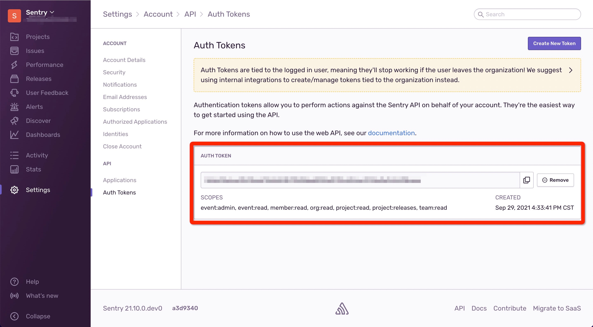
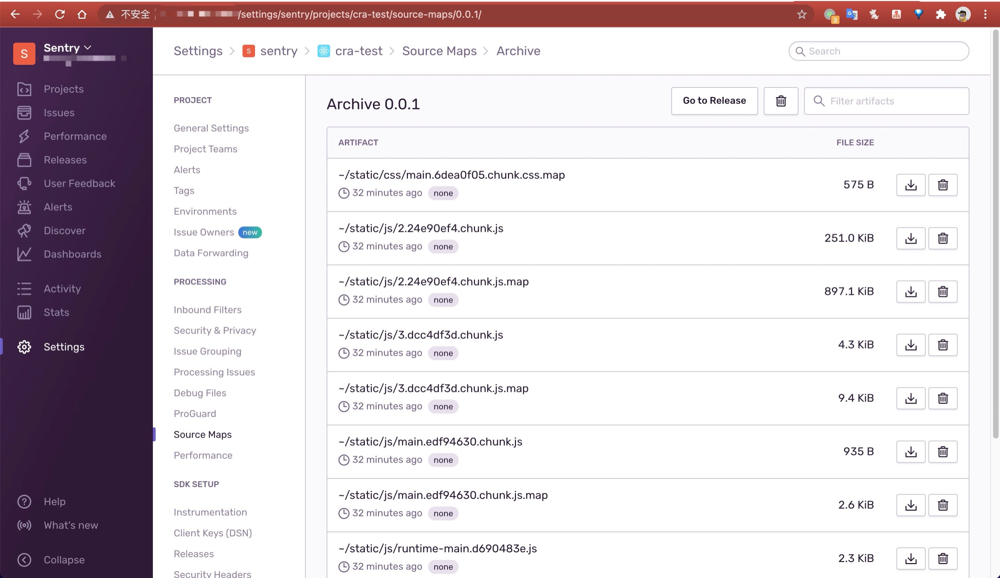
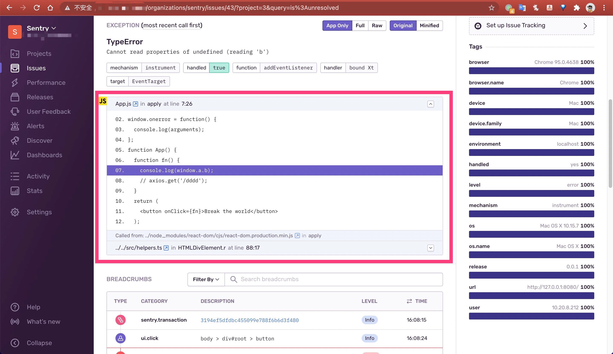

#### Sentry 实战

## 上传 `sourcemap`

目前为止，我们在 `sentry` 管理界面中看到的错误堆栈信息，是压缩后的代码。为了看到更详细的源文件信息，我们可以上传 `sourcemap` 文件到sentry来解决。

可以通过两种方式上传：

- `sentry-cli` 命令行工具
- `webpack` 插件

第一种方式是在自己开发电脑上手动上传，
推荐使用第二种，可以集成到部署环节中自动上传。

### 方式一：通过 `sentry-cli` 命令行工具上传 `sourcemap`

- [sentry-cli官方文档](https://docs.sentry.io/product/cli/)

1.在开发电脑安装`@sentry/cli`

  ```bash
  npm install -g --unsafe-perm=true --allow-root @sentry/cli
  sentry-cli -h
  ```

2.配置 `sentry-cli`

  在上传之前，我们需要配置一下 `sentry-cli`，主要配置以下几个信息：

  1. `url`: 要上传的 `sentry` 服务的地址，即我们通过 `docker` 启动的服务的地址
  2. `org`: 组织名称，可以在 `sentry` 管理界面的 `Settings` 中设置组织
  3. `project`: `sentry` 项目名，可以在 `sentry管理界面` 的`Projects`中查看、创建、设置项目
  4. `token`: `sentry` 服务准入 `sentry-cli` 上传的鉴权 `token`，可以在 `sentry管理界面` 的 `Settings -> Account -> API -> Auth Tokens` 中创建和删除

3.执行一下命令创建 `sentry-cli` 配置文件

  ```bash
  sentry-cli --url http://127.0.0.1:9000 login
  ```

4.命令行中弹出选择

  ```bash
  This helps you signing in your sentry-cli with an authentication token.
  If you do not yet have a token ready we can bring up a browser for you
  to create a token now.

  Sentry server: 10.10.8.46
  Open browser now? [y/n] y
  ```

- 选择`n`，则提示输入 `token`，`token` 可以在 `sentry管理界面` 的 `Settings -> Account -> API -> Auth Tokens` 中创建，然后粘贴到命令行

- 选择`y`，则会自动打开浏览器到 `sentry管理界面` 的 `Settings -> Account -> API -> Auth Tokens`，创建或直接复制 `token` 来粘贴

  

5.命令执行完成后，会生成文件 `~/.sentryclirc`

  ```bash
  vim ~/.sentryclirc
  ```

  ```bash
  # ~/.sentryclirc
  [auth]
  token=3e5e95abce3541bxxxxxxxxxxxxxxxxxxxx

  [defaults]
  url=http://127.0.0.1:9000
  org=sentry
  project=cra-test
  ```

- 这个文件也可以直接写在前端项目根目录中，`sentry-cli` 命令会优先读取当前目录下的 `.sentryclirc` 文件，如果没有这个文件，才会读取 `~/.sentryclirc`

6.手动上传 `sourcemap`

- 编译前端项目，生成 `build` 目录，其中包含 `sourcemap` 文件

  ```bash
  npm run build
  ```

- 在上传之前，我们先看下 `sentry` 管理界面 `Settings -> sentry -> Projects -> cra-test -> Source Maps -> Archive`，会发现列表中有一个 `0.0.1` 版本，这个版本是我们在前端项目里通过 `sentry.init` 的 `release` 配置的，只要前端上传过报错信息，就会在管理界面生成这个版本。目前列表中应该没有任何文件。

- 上传命令，会把本地的 `./build` 文件夹下的 `sourcemap` 文件，上传到 `sentry` 服务，并且指定上传到 `Archive` 为 `0.0.1` 版本中：

  ```bash
  sentry-cli releases files 0.0.1 upload-sourcemaps --url-prefix '~/' './build'
  ```

  其中 `--url-prefix` 是指 `sentry` 读取 `sourcemap` 文件服务的路径，如果项目没有部署在域名根目录，则需要调整这个参数

  ```bash
  # 执行结果
  > Found 9 release files
  > Analyzing 9 sources
  > Analyzing completed in 0.051s
  > Rewriting sources
  > Rewriting completed in 0.027s
  > Adding source map references
  > Bundling files for upload... 
  > Bundling completed in 0.059s
  > Optimizing completed in 0.002s
  > Uploading completed in 0.194s
  > Uploaded release files to Sentry
  > Processing completed in 0.1s
  > File upload complete (processing pending on server)

  Source Map Upload Report
    Minified Scripts
      ~/static/js/2.24e90ef4.chunk.js (sourcemap at 2.24e90ef4.chunk.js.map)
      ~/static/js/3.dcc4df3d.chunk.js (sourcemap at 3.dcc4df3d.chunk.js.map)
      ~/static/js/main.edf94630.chunk.js (sourcemap at main.edf94630.chunk.js.map)
      ~/static/js/runtime-main.d690483e.js (sourcemap at runtime-main.d690483e.js.map)
    Source Maps
      ~/static/css/main.6dea0f05.chunk.css.map
      ~/static/js/2.24e90ef4.chunk.js.map
      ~/static/js/3.dcc4df3d.chunk.js.map
      ~/static/js/main.edf94630.chunk.js.map
      ~/static/js/runtime-main.d690483e.js.map
  ```

- 回到 `sentry` 管理界面 `Archive`，可以看到 `sourcemap` 文件已经上传

  

7.查看效果

- 通过`http-server`启动前端服务

  ```bash
  cd build
  http-server
  ```

- 访问 <http://127.0.0.1:8080>

- 点击按钮手动制造并上报错误

- 回到 `sentry` 管理界面，查看对应 `issue`，可以看到具体信息：哪个文件发生了错误，错误的行列数，错误行附近的源代码

  

- 删除 `sourcemap`

  ```bash
  sentry-cli releases files 0.0.1 delete --all
  ```

  ```bash
  D ~/static/css/main.6dea0f05.chunk.css.map
  D ~/static/js/2.24e90ef4.chunk.js
  D ~/static/js/2.24e90ef4.chunk.js.map
  D ~/static/js/3.dcc4df3d.chunk.js
  D ~/static/js/3.dcc4df3d.chunk.js.map
  D ~/static/js/main.edf94630.chunk.js
  D ~/static/js/main.edf94630.chunk.js.map
  D ~/static/js/runtime-main.d690483e.js
  D ~/static/js/runtime-main.d690483e.js.map
  ```

### 方式二、通过 `webpack` 插件上传 `sourcemap`

第二种方式会在 `npm run build` 时自动上传 `sourcemap`，推荐使用这种方式

1.安装 `@sentry/webpack-plugin`

  ```bash
  npm i -D @sentry/webpack-plugin
  ```

- [@sentry/webpack-plugin官方文档](https://github.com/getsentry/sentry-webpack-plugin)

2.React配置 `webpack`

- `create-react-app` 修改 `webpack` 配置参考: <https://github.com/timarney/react-app-rewired>

  ```js
  // config-overrides.js
  const SentryCliPlugin = require('@sentry/webpack-plugin');
  module.exports = function override(config, env) {
    config.devtool = 'source-map';
    config.plugins.push(
      new SentryCliPlugin({
        release: '0.0.1',
        authToken: 'xxxxxxxx',
        url: 'http://127.0.0.1:9000',
        org: 'sentry',
        project: 'cra-test',
        urlPrefix: '~/',
        include: './build',
        ignore: ['node_modules'],
      })
    );
    return config;
  }
  ```

- 配置中的 `release`、`authToken`、`url`、`org`、`project`、`urlPrefix`、`include` 定义同 `.sentryclirc`
- `ignore`: 上传时要忽略的文件夹或文件类型

2.Vue配置 `webpack`
- `vue-cli3` 修改webpack配置

```
const SentryCliPlugin = require('@sentry/webpack-plugin');
module.exports = {
    configureWebpack: {
        devtool: "source-map",
        plugins: [
            new SentryCliPlugin({
                release: 'pro@1.0.3',
                authToken: 'cd9d14fe889948bd84122d6c9603963c6ada0526777a441f9bd534d522249bd6',
                url: 'http://192.168.0.105:9000',
                org: 'test_organization',
                project: 'hello-world',
                urlPrefix: '~/',
                include: './dist',
                ignore: ['node_modules'],
            })
        ],
    },
}
```

3.`npm run build` 编译，会产生一下信息：

  ```bash
  Creating an optimized production build...
  > Found 9 release files
  > Analyzing 9 sources
  > Analyzing completed in 0.065s
  > Rewriting sources
  > Rewriting completed in 0.039s
  > Adding source map references
  > Bundling files for upload... ~/static/js/2.24e90ef4.chunk.js.map
  > Bundling completed in 0.072s
  > Optimizing completed in 0.001s
  > Uploading completed in 0.146s
  > Uploaded release files to Sentry
  > Processing completed in 0.069s
  > File upload complete (processing pending on server)
  > Organization: sentry
  > Project: cra-test
  > Release: 0.0.1
  > Dist: None

  Source Map Upload Report
    Minified Scripts
      ~/static/js/2.24e90ef4.chunk.js (sourcemap at 2.24e90ef4.chunk.js.map)
      ~/static/js/3.dcc4df3d.chunk.js (sourcemap at 3.dcc4df3d.chunk.js.map)
      ~/static/js/main.edf94630.chunk.js (sourcemap at main.edf94630.chunk.js.map)
      ~/static/js/runtime-main.d690483e.js (sourcemap at runtime-main.d690483e.js.map)
    Source Maps
      ~/static/css/main.6dea0f05.chunk.css.map
      ~/static/js/2.24e90ef4.chunk.js.map
      ~/static/js/3.dcc4df3d.chunk.js.map
      ~/static/js/main.edf94630.chunk.js.map
      ~/static/js/runtime-main.d690483e.js.map
  ```

4.回到 `sentry` 管理界面 `Archive`，可以看到 `sourcemap` 文件已经上传到 `sentry` 服务中

5.在上传完以后，需要删除 `sourcemap` 文件，不要把它们部署到线上去了

  ```
  // package.json
  {
    "scripts": {
      "build": "react-app-rewired build && rm -rf dist/*.map",
    },
  }
  ```
