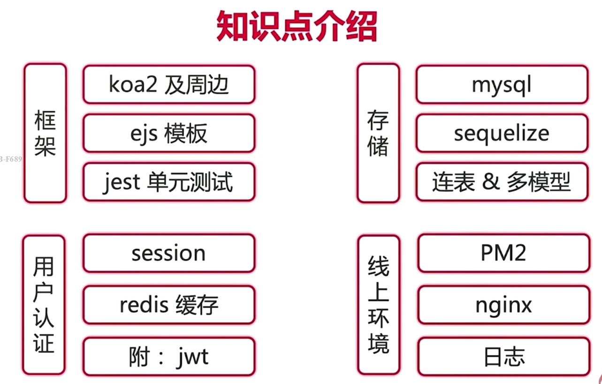
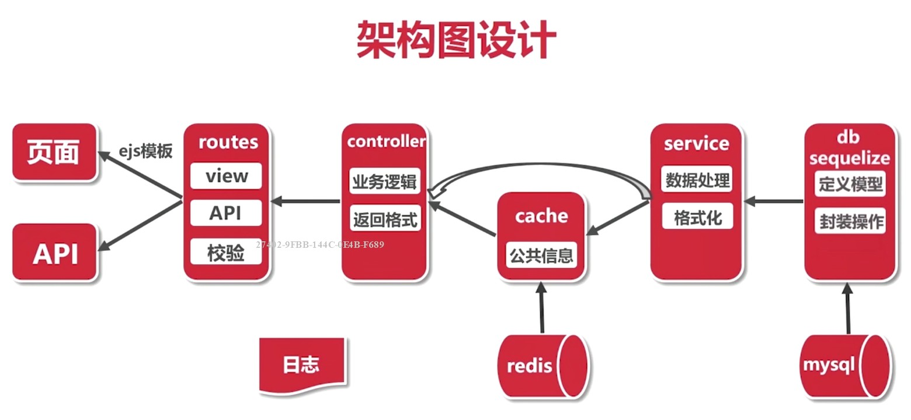
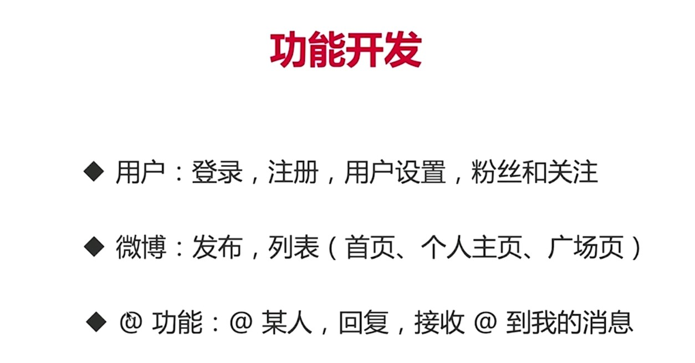

## 第1讲: 项目概述









## 第2讲: 项目概述

### 2.1 技术选型: 

- 框架选型(koa2 vs express vs egg)
    - express: 基于回调函数, 并不友好
    - koa2: 基于异步函数async/await
    - egg: 相当于koa2的再封装, 套路式的开发web server

&nbsp;
- 数据库选型(mysql vs mongodb)
    - mysql: 企业使用更广泛且成本低(关系型数据库)
    - mongodb: 更适合一些零散的不重要的数据存储, 如:播放时间(非关系型数据库)

&nbsp;
- 登录技术(session vs jwt)
    - session: 广泛, 页面统一的项目
    - jwt: 流行, 更适合前后端分离, 多端的项目

&nbsp;
- 前端页面(ejs模板引擎 vs vue/react前端框架)
    - ejs: 后台使用
    - vue/react: 前端框架

&nbsp;
- 缓存数据库(redis)
    - redis: 主流, 没有其他竞争对手

&nbsp;
- 单元测试(jest)
    - jest: 主流、简单易用, 支持多框架
  
最终选型: koa2+mysql+session+ejs+redis+jest  
选型过程:  
1. koa2可以更好理解整个过程, 相当于学习一边egg的封装过程
2. 基于主流技术
3. 最后会补充jwt使用
4. 更专注于后台开发,不关注前端vue/react 

### 2.2 介绍koa2-创建项目:

```
// 1.安装依赖
npm install -g koa-generator

// 2.创建项目(-e: 使用ejs)
koa2 -e koa2-weibo-code

// 3.安装依赖跑起来
npm i
npm run dev

// 4.访问
访问localhost:3000

// 5.添加环境变量
npm i cross-env

// 6.修改项目环境变量，package.json
"dev": "cross-env NODE_ENV=dev ./node_modules/.bin/nodemon --inspect=9229 bin/www",
"prd": "cross-env NODE_ENV=production pm2 start pm2.conf.json",
```

### 2.3 介绍koa2-代码结构

```
// 1.调整代码结构
// 把public、routes、views、app.js放到src文件夹

// 2.修改bin/www启动文件
var app = require('../src/app');
```


### 2.4 介绍koa2-开发路由

src/routes/index.js

```
// get动态参数
router.get('/profile/:username', async (ctx, next) => {
  const { username } = ctx.params
  ctx.body = {
    title: 'this is profile page',
    username
  }
})

router.get('/loadMore/:username/:pageIndex', (ctx, next) => {
  const { username, pageIndex } = ctx.params
  ctx.body = {
    title: 'this is profile page',
    username,
    pageIndex
  }
})
```

src/routes/users.js

```
//post获取参数
router.post('/login', async (ctx, next) => {
  const {userName, password} = ctx.request.body
  ctx.body = {
    id: 100,
    userName,
    password
  }
})
```

### 2.5 介绍ejs-变量和判断、循环和组件

ejs语法: `<% js语法写这 %>`, `<%= 要保留在html的值写这 %>`, 不确实是否存在的值添加local`<%= local.xxxx %>`　　
示例:  
```
<!DOCTYPE html>
<html lang="en">
<head>
    <meta charset="UTF-8">
    <title>文件列表</title>
</head>
<body>
    <h1><%=pathname%></h1>
    
    <!-- 循环 -->
    <%dirs.forEach((item) => {%>
        <p><a href="<%=item.url%>"><%=item.dir%></a></p>
    <%})%>
    
    <!-- 判断 -->
    <% if(isMe) { %>
        <a href='#'>@ 提到我的(3)</a>
    <% } else { %>
        <button>关注我</button>
    <% } %>
    
    <!--组件(组件内可写script标签)-->
    <%- include('widgets/userInfo', {
        msg
    })%>
</body>
</html>
```

>　以上做的就是SSR!

### 2.6 介绍mysql

见博客内另一篇文章


## 第3讲: 介绍登录

### 3.1 介绍redis 

见博客内另一篇文章

确保本机安装好redis即可。

### 3.2 微博项目使用redis

```
npm i redis
```

#### 3.2.1 src/conf/db.js

```
/**
 * @description 存储配置
 * @author 学浪
 */
const {NODE_ENV, ENVS} = require('../utils/env')

let REDIS_CONF = {
    [ENVS.DEV]: {
        host: '127.0.0.1',
        port: 6379
    },
    [ENVS.PRD]: {
        host: '127.0.0.1',
        port: 6379
    },
}

module.exports = {
    REDIS_CONF: REDIS_CONF[NODE_ENV]
}
```

#### 3.2.2 src/cache/_redis.js

```
/**
 * @description 连接 redis 的方法 get set
 * @author 学浪
 */

const {createClient} = require('redis');
const {REDIS_CONF} = require('../conf/db')

// 创建客户端
const client = createClient(REDIS_CONF.port, REDIS_CONF.host);
client.on('error', (err) => console.log('Redis Client Error', err));
client.connect().then(() => {
    console.log('连接redis成功')
}).catch((err) => {
    console.log('连接redis失败:', err)
})

/**
 * @description 获取
 * @param key 键
 */
async function get(key) {
    const value = await client.get(key)
    try {
        return JSON.parse(value)
    } catch(err) {
        return value
    }
}

/**
 * 设置
 * @param key 键
 * @param val 值
 * @param timeout 过期时间, 单位 s
 */
async function set(key, val, timeout = 60 * 60) {
    if(typeof val === 'object') val = JSON.stringify(val)
    await client.set(key, val)
    await client.expire(key, timeout)
}

module.exports = {
    get,
    set
}
```

#### 3.2.3 src/utils/env.js

```
/**
 * @description 环境变量
 * @author 学浪
 */

const NODE_ENV = process.env.NODE_ENV;
const ENVS = {
    'DEV': 'dev',
    'PRD': 'prd',
}

module.exports = {
    NODE_ENV,
    ENVS,
    isDev: NODE_ENV === ENVS.DEV,
    notDev: NODE_ENV !== ENVS.DEV,
    isPrd: NODE_ENV === ENVS.PRD,
    notPrd: NODE_ENV !== ENVS.PRD,
}
```

### 3.3 微博项目使用redis2

cookie: 存储session的key
session: 存储用户信息

#### 3.3.1 koa2使用session,并存到redis

```
npm i koa-redis koa-generic-session -S
```

src/app.js

```
const session = require('koa-generic-session')
const redisStore = require('koa-redis')
const {REDIS_CONF} = require('./conf/db')

// session配置
app.keys = ['UIsda_8967#$']
app.use(session({
    key: 'weibo.sid', //cookie的name
    prefix: 'weibo:sess:', //redis key的前缀, 默认`koa:sess:`
    cookie: {
        path: '/',
        httpOnly: true, //只能服务端修改cookie
        maxAge: 24 * 60 * 60 * 1000, //ms
    },
    // ttl: 24 * 60 * 60 * 1000,
    store: redisStore({
        all: `${REDIS_CONF.host}:${REDIS_CONF.port}`
    })
}))
```

src/routes/users.js (需要使用一下session, 中间件才会生效)

```
router.get('/session', function (ctx, next) {
    let session = ctx.session
    if(session.viewCount == null) {
        session.viewCount = 0
    }else {
        session.viewCount++
    }
    ctx.body = {
        title: '测试redis session',
        viewCount: session.viewCount
    }
})
```

浏览器访问: http://localhost:3000/users/session,  
服务端操作session(中间件的,已经指向redis),   
中间件返回session的key给前端的cookie  

### 3.4 jest基础使用

#### 3.4.1 安装

```
npm i jest -D
```

添加运行命令 (package.json)

```
"test": "cross-env NODE_ENV=test jest --runInBand --forceExit --colors"
```

添加测试用例 (/test/example.test.js)

```
/**
 * @description 测试jest可用性
 * @author 学浪
 */

function add(a, b) {
    return a + b
}
test('10 + 20 = 30', () => {
    let count = add(10, 20)
    expect(count).toBe(30)
})
```


### 99 坑

#### 1. Client does not support authentication protocol requested by server

```
npm i mysql 改为 npm i mysql2
```


