## 第1讲: 项目概述


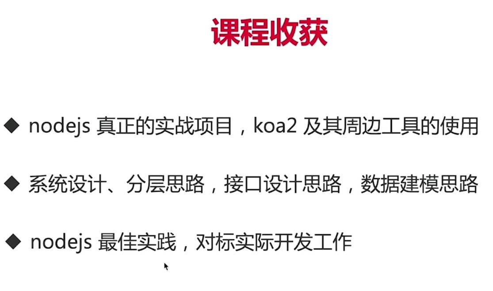


## 第2讲: 项目概述

### 2.1 技术选型: 

- 框架选型(koa2 vs express vs egg)
    - express: 基于回调函数, 并不友好
    - koa2: 基于异步函数async/await
    - egg: 相当于koa2的再封装, 套路式的开发web server

&nbsp;
- 数据库选型(mysql vs mongodb)
    - mysql: 企业使用更广泛且成本低(关系型数据库)
    - mongodb: 更适合一些零散的不重要的数据存储, 如:播放时间(非关系型数据库)

&nbsp;
- 登录技术(session vs jwt)
    - session: 广泛, 页面统一的项目
    - jwt: 流行, 更适合前后端分离, 多端的项目

&nbsp;
- 前端页面(ejs模板引擎 vs vue/react前端框架)
    - ejs: 后台使用
    - vue/react: 前端框架

&nbsp;
- 缓存数据库(redis)
    - redis: 主流, 没有其他竞争对手

&nbsp;
- 单元测试(jest)
    - jest: 主流、简单易用, 支持多框架
  
最终选型: koa2+mysql+session+ejs+redis+jest  
选型过程:  
1. koa2可以更好理解整个过程, 相当于学习一边egg的封装过程
2. 基于主流技术
3. 最后会补充jwt使用
4. 更专注于后台开发,不关注前端vue/react 

### 2.2 介绍koa2-创建项目:

```
// 1.安装依赖
npm install -g koa-generator

// 2.创建项目(-e: 使用ejs)
koa2 -e koa2-weibo-code

// 3.安装依赖跑起来
npm i
npm run dev

// 4.访问
访问localhost:3000

// 5.添加环境变量
npm i cross-env

// 6.修改项目环境变量，package.json
"dev": "cross-env NODE_ENV=dev ./node_modules/.bin/nodemon --inspect=9229 bin/www",
"prd": "cross-env NODE_ENV=production pm2 start pm2.conf.json",
```

### 2.3 介绍koa2-代码结构

```
// 1.调整代码结构
// 把public、routes、views、app.js放到src文件夹

// 2.修改bin/www启动文件
var app = require('../src/app');
```


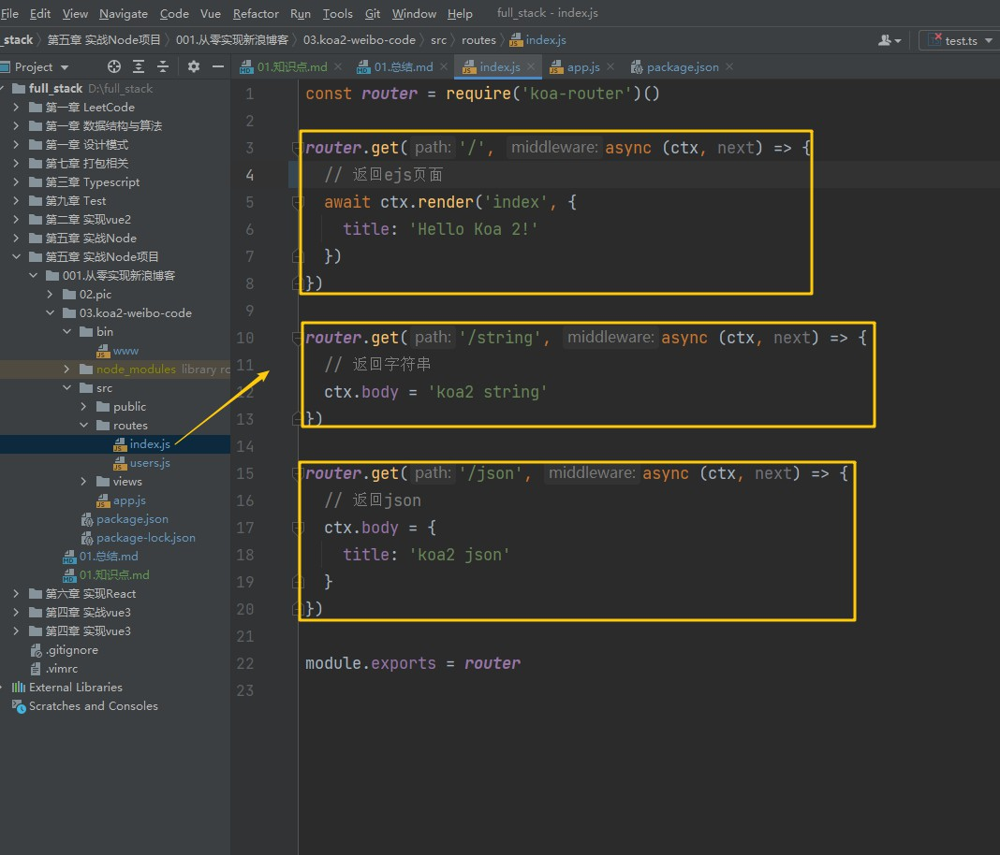

### 2.4 介绍koa2-开发路由

src/routes/index.js

```
// get动态参数
router.get('/profile/:username', async (ctx, next) => {
  const { username } = ctx.params
  ctx.body = {
    title: 'this is profile page',
    username
  }
})

router.get('/loadMore/:username/:pageIndex', (ctx, next) => {
  const { username, pageIndex } = ctx.params
  ctx.body = {
    title: 'this is profile page',
    username,
    pageIndex
  }
})
```

src/routes/users.js

```
//post获取参数
router.post('/login', async (ctx, next) => {
  const {userName, password} = ctx.request.body
  ctx.body = {
    id: 100,
    userName,
    password
  }
})
```

### 2.5 介绍ejs-变量和判断、循环和组件

ejs语法: `<% js语法写这 %>`, `<%= 要保留在html的值写这 %>`, 不确实是否存在的值添加local`<%= local.xxxx %>`　　
示例:  
```
<!DOCTYPE html>
<html lang="en">
<head>
    <meta charset="UTF-8">
    <title>文件列表</title>
</head>
<body>
    <h1><%=pathname%></h1>
    
    <!-- 循环 -->
    <%dirs.forEach((item) => {%>
        <p><a href="<%=item.url%>"><%=item.dir%></a></p>
    <%})%>
    
    <!-- 判断 -->
    <% if(isMe) { %>
        <a href='#'>@ 提到我的(3)</a>
    <% } else { %>
        <button>关注我</button>
    <% } %>
    
    <!--组件(组件内可写script标签)-->
    <%- include('widgets/userInfo', {
        msg
    })%>
</body>
</html>
```

>　以上做的就是SSR!

### 2.6 介绍mysql

见博客内另一篇文章


## 第3讲: 介绍登录

### 3.1 介绍redis 

见博客内另一篇文章

确保本机安装好redis即可。

### 3.2 微博项目使用redis

```
npm i redis
```

#### 3.2.1 src/conf/db.js

```
/**
 * @description 存储配置
 * @author 学浪
 */
const {NODE_ENV, ENVS} = require('../utils/env')

let REDIS_CONF = {
    [ENVS.DEV]: {
        host: '127.0.0.1',
        port: 6379
    },
    [ENVS.PRD]: {
        host: '127.0.0.1',
        port: 6379
    },
}

module.exports = {
    REDIS_CONF: REDIS_CONF[NODE_ENV]
}
```

#### 3.2.2 src/cache/_redis.js

```
/**
 * @description 连接 redis 的方法 get set
 * @author 学浪
 */

const {createClient} = require('redis');
const {REDIS_CONF} = require('../conf/db')

// 创建客户端
const client = createClient(REDIS_CONF.port, REDIS_CONF.host);
client.on('error', (err) => console.log('Redis Client Error', err));
client.connect().then(() => {
    console.log('连接redis成功')
}).catch((err) => {
    console.log('连接redis失败:', err)
})

/**
 * @description 获取
 * @param key 键
 */
async function get(key) {
    const value = await client.get(key)
    try {
        return JSON.parse(value)
    } catch(err) {
        return value
    }
}

/**
 * 设置
 * @param key 键
 * @param val 值
 * @param timeout 过期时间, 单位 s
 */
async function set(key, val, timeout = 60 * 60) {
    if(typeof val === 'object') val = JSON.stringify(val)
    await client.set(key, val)
    await client.expire(key, timeout)
}

module.exports = {
    get,
    set
}
```

#### 3.2.3 src/utils/env.js

```
/**
 * @description 环境变量
 * @author 学浪
 */

const NODE_ENV = process.env.NODE_ENV;
const ENVS = {
    'DEV': 'dev',
    'PRD': 'prd',
}

module.exports = {
    NODE_ENV,
    ENVS,
    isDev: NODE_ENV === ENVS.DEV,
    notDev: NODE_ENV !== ENVS.DEV,
    isPrd: NODE_ENV === ENVS.PRD,
    notPrd: NODE_ENV !== ENVS.PRD,
}
```

### 3.3 微博项目使用redis2

cookie: 存储session的key
session: 存储用户信息

#### 3.3.1 koa2使用session,并存到redis

```
npm i koa-redis koa-generic-session -S
```

src/app.js

```
const session = require('koa-generic-session')
const redisStore = require('koa-redis')
const {REDIS_CONF} = require('./conf/db')

// session配置
app.keys = ['UIsda_8967#$']
app.use(session({
    key: 'weibo.sid', //cookie的name
    prefix: 'weibo:sess:', //redis key的前缀, 默认`koa:sess:`
    cookie: {
        path: '/',
        httpOnly: true, //只能服务端修改cookie
        maxAge: 24 * 60 * 60 * 1000, //ms
    },
    // ttl: 24 * 60 * 60 * 1000,
    store: redisStore({
        all: `${REDIS_CONF.host}:${REDIS_CONF.port}`
    })
}))
```

src/routes/users.js (需要使用一下session, 中间件才会生效)

```
router.get('/session', function (ctx, next) {
    let session = ctx.session
    if(session.viewCount == null) {
        session.viewCount = 0
    }else {
        session.viewCount++
    }
    ctx.body = {
        title: '测试redis session',
        viewCount: session.viewCount
    }
})
```

浏览器访问: http://localhost:3000/users/session,  
服务端操作session(中间件的,已经指向redis),   
中间件返回session的key给前端的cookie  

### 3.4 jest基础使用

- expect(10+20).toBe(30)
- expect({a: 'b'}).toEqual({a: 'b'})

#### 3.4.1 jest可行性测试

```
npm i jest -D
```

添加运行命令 (package.json)

```
"test": "cross-env NODE_ENV=test jest --runInBand --forceExit --colors"
```

添加测试用例 (/test/example.test.js)

```
/**
 * @description 测试jest可用性
 * @author 学浪
 */

function add(a, b) {
    return a + b
}
test('10 + 20 = 30', () => {
    let count = add(10, 20)
    expect(count).toBe(30)
})
```

#### 3.4.1 jest测试http请求

```
npm i supertest -D
```

使用supertest测试项目 (/test/server.js)

```
const request = require('supertest')
const server = require('../src/app').callback()

module.exports = request(server)
```

添加测试用例 (/test/example.test.js)

```
/**
 * get测试
 */
test('接口测试: /json', async () => {
    const res = await server.get('/json')
    expect(res.body).toEqual({title: 'koa2 json'})
})

/**
 * post测试
 */
test('接口测试: /json', async () => {
    const res = await server.post('/postjson').send({
        message: '123'
    })
    expect(res.body).toEqual({title: '123'})
})
```

添加路由 (src/routes/index.js)

```
router.get('/json', async (ctx, next) => {
  // 返回json
  ctx.body = {
    title: 'koa2 json'
  }
})

router.post('/postjson', async (ctx, next) => {
    const {message} = ctx.request.body
    ctx.body = {
        title: message
    }
})

```

### 3.5 koa2开发环境完善

#### 1. eslint

```
npm install eslint @babel/eslint-parser -D
```

package.json

```
"lint": "eslint --ext .js ./src",
// 可以加--fix来自动修复一些问题
```

/.eslintrc.json

```
{
    "parser": "@babel/eslint-parser",
    "parserOptions": {
        "requireConfigFile": false
    },
    "env": {
        "es6": true,
        "commonjs": true,
        "node": true
    },
    "rules": {
        "indent": ["error", 4],
        "quotes": [
            "error",
            "single",
            {
              "allowTemplateLiterals": true
            }
        ],
        "semi": [
            "error",
            "never"
        ]
    }
}
```

/.eslintignore

```
node_modules
test
src/public
```

跑一次命令, npm run lint

#### 2. 调试

- package.json添加`--inspect=9229`

```
"dev": "cross-env NODE_ENV=dev ./node_modules/.bin/nodemon --inspect=9229 bin/www",
```

- 启动项目 `npm run dev`  
- 访问chrome/edge: `chrome://inspect/#devices`  
- 代码内添加 `debugger`


- 也可以选择在webstorm中调试, 直接下面截图的即可

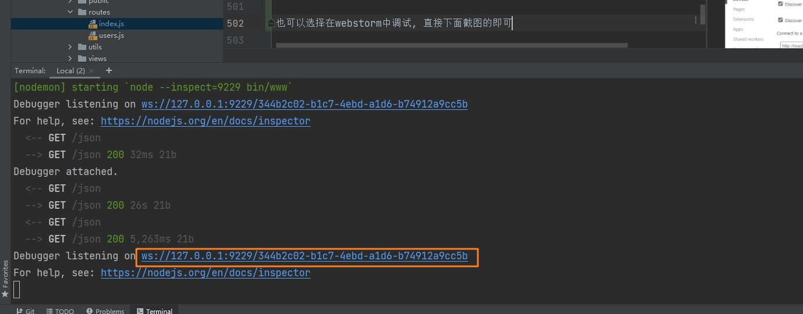

#### 3. 404和error页

添加自己想要的404和error的ejs页面到src/views内

src/routes/view/error.js

```
/**
 * @description error 404 路由
 * @author 学浪
 */

const router = require('koa-router')()

router.get('/error', async (ctx, next) => {
    await ctx.render('error')
})

router.get('*', async (ctx, next) => {
    await ctx.render('404')
})

module.exports = router
```

src/app.js

```
+ const {isPrd} = require('./utils/env')
+ const errorViewRouter = require('./routes/view/error')
 
- onerror(app)
+ let onErrorConf = {}
+ if (isPrd) onErrorConf = {redirect: 'error'}
+ onerror(app, onErrorConf)
 
+ app.use(errorViewRouter.routes(), errorViewRouter.allowedMethods())
```

### 3.6 jwt

#### 1.jwt是什么

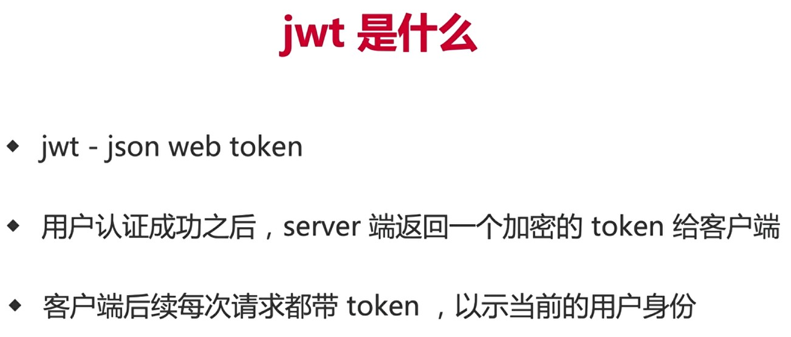

原本是明文访问用户信息, 但有危险, 所以返回jwt加密的。

因为用户信息存储在客户端, 服务端比较不好控制。如踢人。

#### 2.koa2实现jwt

##### 服务器设置token

```
koa2 -e 05.jwt-test
cd 05.jwt-test
npm i koa-jwt -S // 中间件: 各个路由验证token
npm i jsonwebtoken -S // 加密成token, 配置有效期
```

src/app.js

```
const jwt = require('koa-jwt')
const {SECRET} = require('./conf/constants')

app.use(jwt({
    secret: SECRET
}).unless({
    path: [/^\/users\/login/] // 定义哪些路由不使用该中间件
}))
```

conf/constants.js

```
module.exports = {
    SECRET: 'uhKSO_231$J'
}
```

/routes/users.js

```
const jwt = require('jsonwebtoken')
const {SECRET} = require('../conf/constants')

router.post('/login', async (ctx, next) => {
    let {userName, password} = ctx.request.body

    let userInfo
    if (userName === 'lisi' && password === '123') {
        userInfo = {
            id: 1,
            userName: 'lisi',
            nickName: '李四',
            phone: '13511132356'
        }

        let token = jwt.sign(userInfo, SECRET, { expiresIn: '1h'})

        ctx.body = {
            error: 0,
            data: token
        }
    } else {
        ctx.body = {
            error: -1,
            meg: '登录失败'
        }
    }
})
```

> 在没token的时候, 访问/json, 返回401页面

##### 客户端使用token获取用户信息

postman 带token请求


服务端处理token

/routes/users.js

```
const util = require('util')
const verify = util.promisify(jwt.verify)

router.get('/getUserInfo', async (ctx, next) => {
    let token = ctx.header.authorization
    try {
        const payload = await verify(token.split(' ')[1], SECRET)
        ctx.body = {
            error: 0,
            userInfo: payload
        }
    }catch (err) {
        console.log(err)
        ctx.body = {
            error: -1,
            msg: 'verify token failed'
        }
    }
})
```

#### 3.jwt vs session

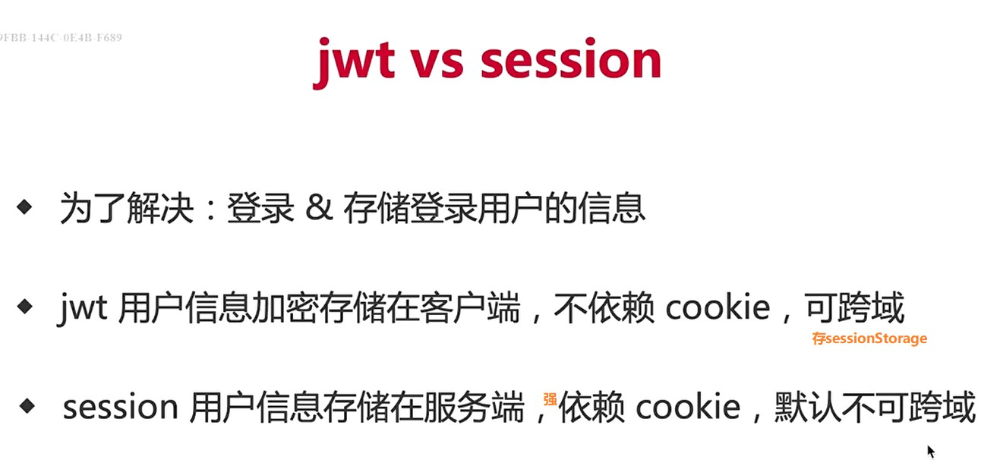

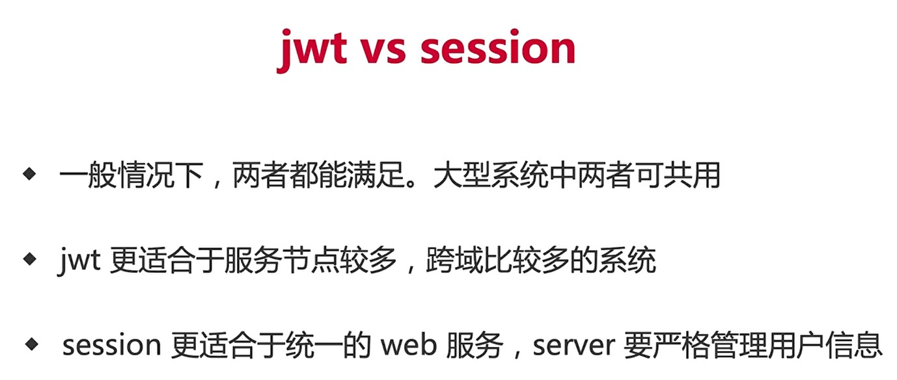


## 第4讲: 技术方案设计

### 4.1 构架图(模块划分、层次先后关系)

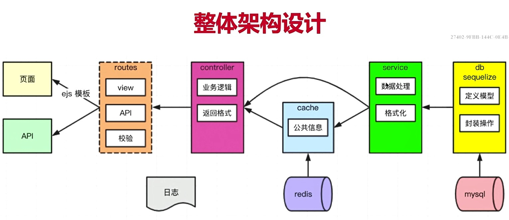

任何看似复杂的设计都是为了系统简单化。

### 4.2 页面和API设计


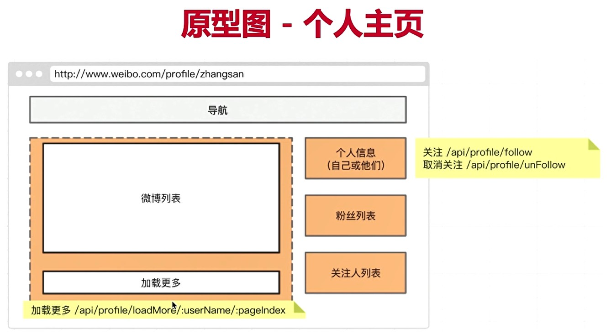

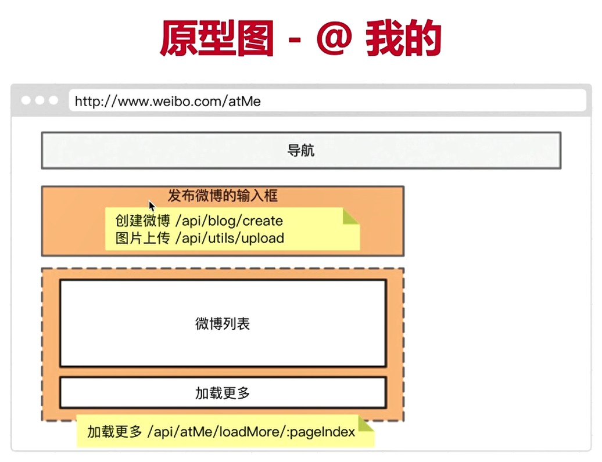

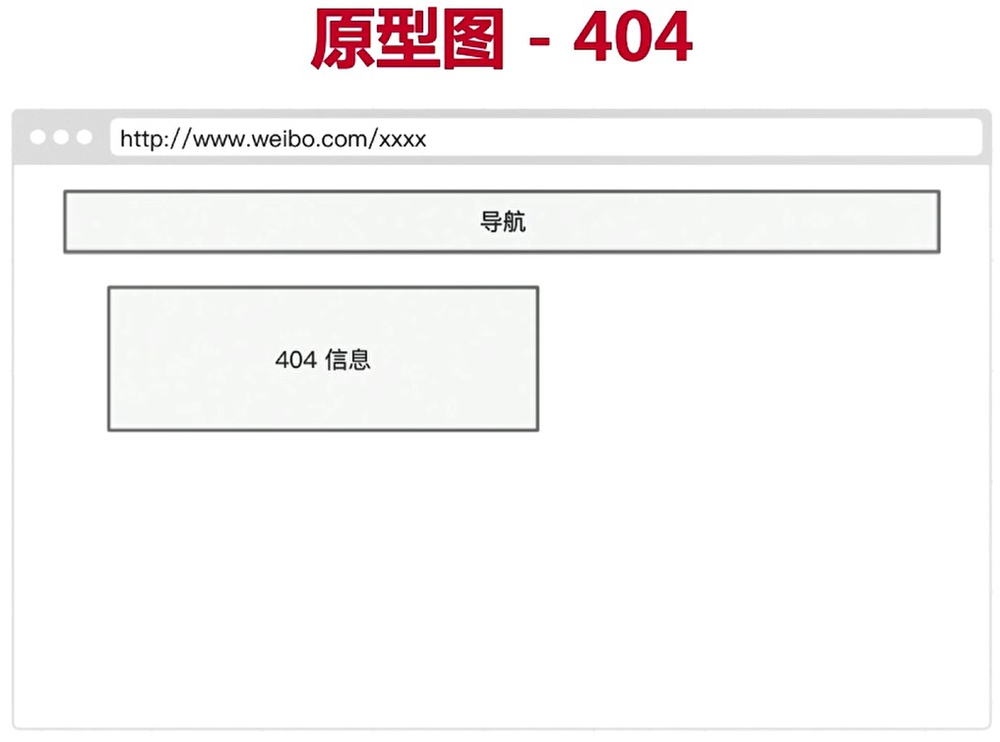

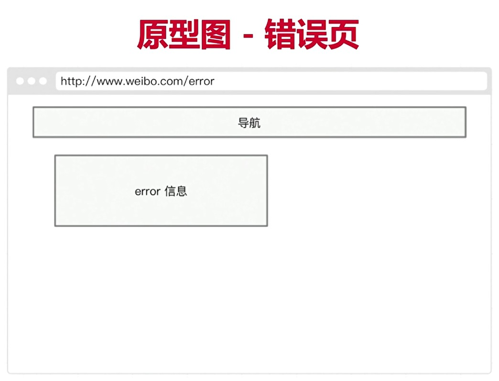


路由汇总

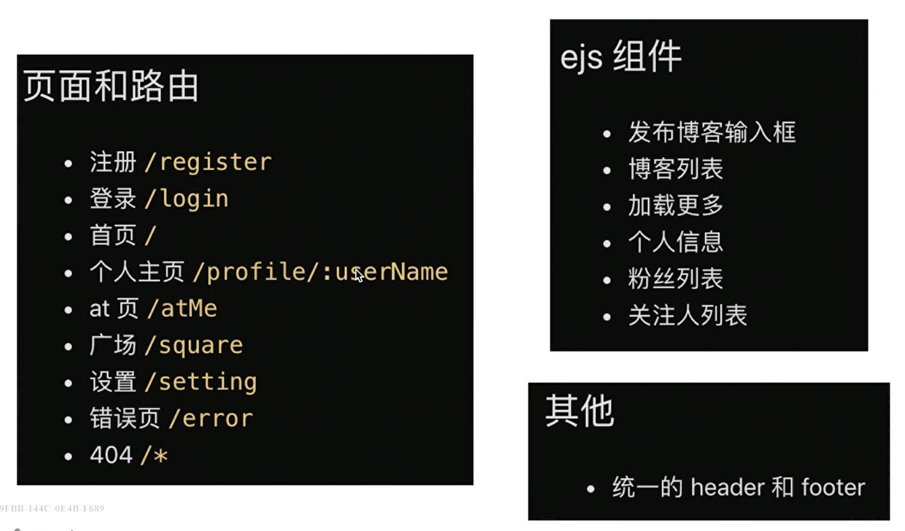

API汇总

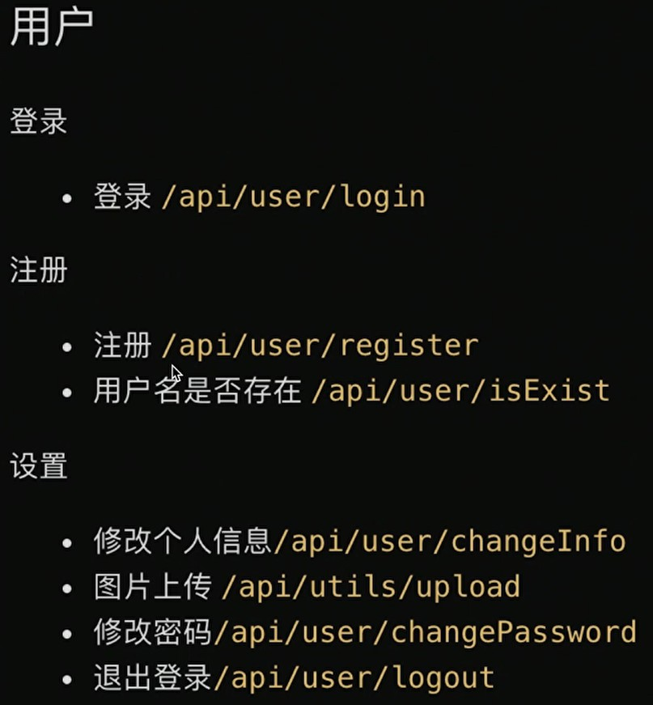


### 4.2 数据模型设计(数据库表)

- ER图
  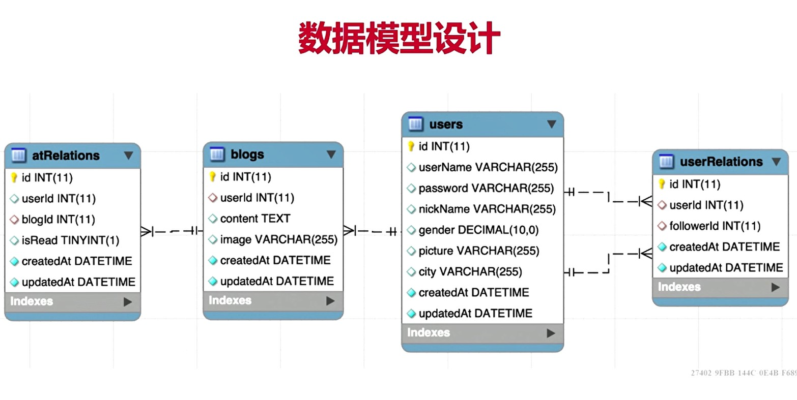


- 关系型数据库 三大范式
  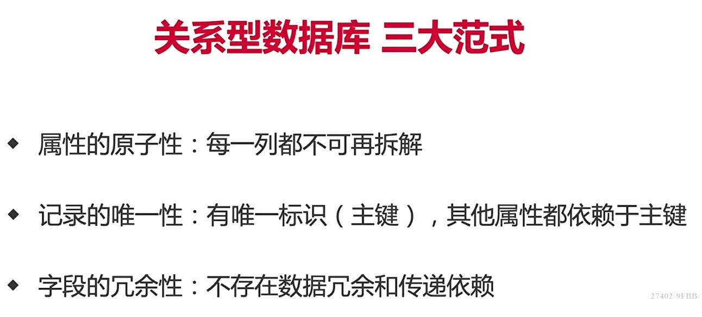
  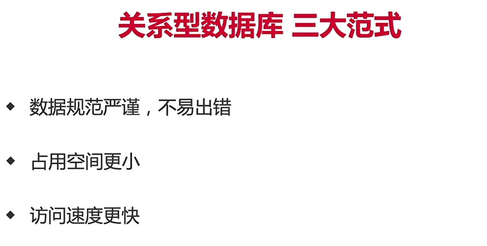


- 数据模型设计
    - 见ER图

### 4.3 其他 (单独功能, 不划分在设计里)

- @功能如何实现?
- 图片上传如何实现?


## 第5讲: 功能列表及开发顺序


## 第5讲: 用户管理

### 5.1 注册页


添加ejs模板

src/views/register.ejs

```
<%- include('layout/header', { title: '微博 - 注册', isNarrow: true })%>

<h1>注册</h1>
<% if (locals.isLogin) { %>
    <p><%= locals.userName%> 您已成功登录，请直接访问<a href="/">首页</a></p>
<% } else { %>
    <form>
        <div class="form-group">
            <input type="text" class="form-control" id="input-username" placeholder="请输入用户名">
            <small id="span-username-info" class="form-text text-muted"></small>
        </div>
        <div class="form-group">
            <input type="password" class="form-control" id="input-password" placeholder="请输入密码">
        </div>
        <div class="form-group">
            <input type="password" class="form-control" id="input-password-repeat" placeholder="重新输入密码">
            <small id="span-password-repeat-info" class="form-text text-muted"></small>
        </div>
        <div class="form-group">
            <select class="form-control" id="select-gender">
                <option value="1">男</option>
                <option value="2">女</option>
                <option value="3">保密</option>
            </select>
        </div>
        <button type="submit" class="btn btn-primary" id="btn-submit">注册</button>
        &nbsp;
        <a href="/login">已有账号，返回登录>></a>
    </form>

    <script>
        $(function() {
            var $inputUserName = $('#input-username')
            var $spanUserNameInfo = $('#span-username-info')
            var $inputPassword = $('#input-password')
            var $inputPasswordRepeat = $('#input-password-repeat')
            var $spanPasswordRepeatInfo = $('#span-password-repeat-info')
            var $selectGender = $('#select-gender')
            var userNameTimeoutId
            var passwordTimeoutId
            var isPasswordSame = false // 默认两次密码不一致
            var isUserNameExist = true // 默认用户名已存在

            // 监听用户名输入
            $inputUserName.on('input', function() {
                // 做一个简单的防抖
                if (userNameTimeoutId) {
                    clearTimeout(userNameTimeoutId)
                }
                userNameTimeoutId = setTimeout(function() {
                    // 判断用户名是否已存在
                    var userName = $inputUserName.val()
                    ajax.post('/api/user/isExist', {
                        userName
                    }, function(err, data) {
                        $spanUserNameInfo.show()
                        if (err) {
                            $spanUserNameInfo.text('用户名可用')
                            isUserNameExist = false
                        } else {
                            $spanUserNameInfo.text('用户名已存在！')
                            isUserNameExist = true
                        }
                    })
                }, 500)
            })

            // 监听验证密码输入
            $inputPasswordRepeat.on('input', function () {
                // 做一个简单的防抖
                if (passwordTimeoutId) {
                    clearTimeout(passwordTimeoutId)
                }
                passwordTimeoutId = setTimeout(function() {
                    var password = $inputPassword.val()
                    var passwordRepeat = $inputPasswordRepeat.val()
                    $spanPasswordRepeatInfo.show()
                    if (password === passwordRepeat) {
                        $spanPasswordRepeatInfo.text('两次密码一致')
                        isPasswordSame = true
                    } else {
                        $spanPasswordRepeatInfo.text('两次密码不一致！')
                        isPasswordSame = false
                    }
                }, 500)
            })

            // 注册事件
            $('#btn-submit').click(function(e) {
                // 阻止默认的提交表单行为
                e.preventDefault()

                // 验证
                if (isUserNameExist) {
                    alert('用户名已存在')
                    return
                }
                if (!isPasswordSame) {
                    alert('两次密码不一致')
                    return
                }

                var userName = $inputUserName.val()
                var password = $inputPassword.val()
                var gender = parseInt($selectGender.val())

                // 提交数据
                ajax.post('/api/user/register', {
                    userName,
                    password,
                    gender
                }, function(err, data) {
                    if (err) {
                        alert(err)
                        return
                    }
                    alert('注册成功，请登录')
                    location.href = '/login'
                })
            })
        })
    </script>
<% } %>

<%- include('layout/footer')%>
```

src/views/login.ejs

```
<%- include('layout/header', { title: '微博 - 登录', isNarrow: true })%>

<h1>登录</h1>
<% if (locals.isLogin) { %>
    <p><%= locals.userName%> 您已成功登录，请直接访问<a href="/">首页</a></p>
<% } else { %>
    <form>
        <div class="form-group">
            <input type="text" class="form-control" id="input-username" placeholder="请输入用户名">
        </div>
        <div class="form-group">
            <input type="password" class="form-control" id="input-password" placeholder="请输入密码">
        </div>
        <button type="submit" class="btn btn-primary" id="btn-submit">登录</button>
        &nbsp;
        <a href="/register">注册账号>></a>
    </form>

    <script>
        $(function() {
            var $inputUserName = $('#input-username')
            var $inputPassword = $('#input-password')
            $('#btn-submit').click(function(e) {
                // 阻止默认的提交表单行为
                e.preventDefault()
                const userName = $inputUserName.val()
                const password = $inputPassword.val()

                // 提交数据
                ajax.post('/api/user/login', {
                    userName,
                    password
                }, function(err, data) {
                    if (err) {
                        alert(err)
                        return
                    }
                    // 跳转到指定 url 或首页
                    var redirectUrl = $.query.get('url') || '/'
                    location.href = redirectUrl
                })
            })
        })
    </script>
<% } %>

<%- include('layout/footer')%>
```

添加路由, password, gender

src/routes/view/user.js

```
/**
 * @description sequelize 实例
 * @author 学浪
 */

const router = require('koa-router')()

router.get('/login', async (ctx, next) => {
    await ctx.render('login', {})
})

router.get('/register', async (ctx, next) => {
    await ctx.render('register', {})
})

module.exports = router
```

src/app.js

```
+ const userViewRouter = require('./routes/view/user')

+ app.use(userViewRouter.routes(), userViewRouter.allowedMethods())
```

### 5.2 user模型

1.新建用户的模型

src/db/model/User.js

```
/**
 * @description 模型 user表
 * @author 学浪
 */

const seq = require('../seq')
const {STRING, DECIMAL} = require('../type')

const User = seq.define('user', {
    // 自动创建: id, 并设为主键、自增
    // 自动创建: createAt 和 updateAt
    userName: {
        type: STRING, // varchar(255)
        allowNull: false,
        unique: true,
        comment: '用户名'
    },
    password: {
        type: STRING, // varchar(255)
        allowNull: false,
        comment: '密码'
    },
    nickName: {
        type: STRING, // varchar(255),
        allowNull: false,
        comment: '昵称'
    },
    gender: {
        type: DECIMAL, // DECIMAL(10,0)
        allowNull: false,
        defaultValue: 3,
        comment: '性别（1 男性，2 女性，3 保密）'
    },
    picture: {
        type: STRING, // varchar(255),
        comment: '头像 图片地址'
    },
    city: {
        type: STRING, // varchar(255),
        comment: '城市'
    },
})

module.exports = User
```

2.封装一个seq的类型

src/db/types.js

```
const Sequelize = require('sequelize')

module.exports = {
    STRING: Sequelize.STRING,
    DECIMAL: Sequelize.DECIMAL,
    TEXT: Sequelize.TEXT,
    INTEGER: Sequelize.INTEGER,
    BOOLEAN: Sequelize.BOOLEAN
}
```

3.因为模型会很多，所以添加一个入口文件

src/db/model/index.js

```
const User = require('./User')

module.exports = {
    User
}
```

4.执行一下同步

src/db/sync.js

```
require('./model');
```

### 5.2 使用整体架构设计编写代码★★

#### 1.添加注册和用户是否存在的路由

src/routes/api/user.js

```
/**
 * @description 注册页API
 * @author 学浪
 */

const router = require('koa-router')()
const {isExist} = require('../../controller/user')

router.prefix('/api/user/')

router.post('/register', async (ctx, next) => {
    const { userName, password, gender } = ctx.request.body
})

router.post('/isExist', async (ctx, next) => {
    const { userName } = ctx.request.body
    ctx.body = await isExist(userName)
})

module.exports = router
```

#### 2.controller层

src/controller/user.js

```
/**
 * @description user controller
 * @author 学浪
 */

const {SuccessModel, ErrorModel} = require('../model/ResModel')
const {registerUserNameNotExistInfo} = require('../model/ErrorInfo')

const {getUserInfo} = require('../services/user')

async function isExist(userName) {
    // 业务逻辑处理
    const userInfo = await getUserInfo(userName)

    // 统一返回格式
    if (userInfo) {
        return new SuccessModel(userInfo) // { errno: 0, data: {...} }
    } else {
        return new ErrorModel(registerUserNameNotExistInfo) // { errno: 10003, message: '用户名未存在' }
    }
}

module.exports = {
    isExist
}
```

src/model/ResModel.js

```
/**
 * @description 接口返回的数据模型
 * @author 学浪
 */

/**
 * 基础模块
 */
class BaseModel {
    constructor({errno, data, message}) {
        this.errno = errno
        if (data) {
            this.data = data
        }
        if (message) {
            this.message = message
        }
    }
}

/**
 * 成功的数据模型
 */
class SuccessModel extends BaseModel {
    constructor(data = {}) {
        super({
            errno: 0,
            data
        })
    }
}

/**
 * 失败的数据模型
 */
class ErrorModel extends BaseModel {
    constructor({ errno, message }) {
        super({
            errno,
            message
        })
    }
}

module.exports = {
    SuccessModel,
    ErrorModel
}
```

src/model/ErrorInfo.js

```
/**
 * @description 失败信息集合，包括 errno 和 message
 * @author 学浪
 */

module.exports = {
    // 用户名未存在
    registerUserNameNotExistInfo: {
        errno: 10001,
        message: '用户名未存在'
    },
}

```

#### 3.services层

src/services/user.js

```
/**
 * @description user service
 * @author 学浪
 */

const User = require('../db/model/User')
const {formatUser} = require('./_format')

async function getUserInfo(userName, password) {
    let whereOpt = {userName}
    if (password) {
        Object.assign(whereOpt, { password })
    }

    // 数据处理
    const result = await User.findOne({
        attributes: ['id', 'userName', 'nickName', 'picture', 'city'],
        where: whereOpt
    })

    // 格式化
    if (result == null) return result
    const formatRes = formatUser(result.dataValues)
    return formatRes
}

module.exports = {
    getUserInfo
}
```

src/services/_format.js

```
/**
 * @description 数据格式化
 * @author 学浪
 */
const {DEFAULT_PICTURE} = require('../conf/constant')

function _formatUserPicture(obj) {
    if (obj.picture == null) {
        obj.picture = DEFAULT_PICTURE
    }
    return obj
}

function formatUser(list) {
    if (list == null) {
        return list
    }

    // 数组
    if (list instanceof Array) {
        return list.map(_formatUserPicture)
    }

    // 单个对象
    return _formatUserPicture(list)
}

module.exports = {
    formatUser
}
```

src/conf/constant.js

```
/**
 * @description 常量集合
 * @author 学浪
 */

module.exports = {
    DEFAULT_PICTURE: 'https://ss2.bdstatic.com/70cFvnSh_Q1YnxGkpoWK1HF6hhy/it/u=550723927,1346838877&fm=27&gp=0.jpg',
}
```

### 5.3 完成"注册"接口

#### 1.添加路由

src/routes/api/user.js

```
const {isExist, register} = require('../../controller/user')

router.post('/register', async (ctx, next) => {
    // 接收参数
    const { userName, password, gender } = ctx.request.body
    // 返回结果
    ctx.body = await register({ userName, password, gender })
})
```

#### 2.添加controller

src/controller/user.js

```
const {
    registerUserNameNotExistInfo,
    registerUserNameExistInfo,
    registerFailInfo
} = require('../model/ErrorInfo')
const {getUserInfo, createUser} = require('../services/user')
const doCrypto = require('../utils/cryp')

/**
 * 注册
 * @param userName 用户名
 * @param password 密码
 * @param gender 性别
 */
async function register({ userName, password, gender }) {
    // 业务逻辑处理
    const userInfo = await getUserInfo(userName)
    if (userInfo) {
        return new ErrorModel(registerUserNameExistInfo)
    }

    // 统一返回格式
    try {
        await createUser({
            userName,
            password: doCrypto(password),
            gender })
        return new SuccessModel()
    }catch (err) {
        // 之后改成错误日志
        console.error(err.message, err.stack)
        return new ErrorModel(registerFailInfo)
    }
}

module.exports = {
    isExist,
    register
}
```

src/utils/cryp.js

```
/**
 * @description 加密
 * @author 学浪
 */

const crypto = require('crypto')
const {CRYPTO_SECRET_KEY} = require('../conf/secretKeys')

/**
 * md5 加密
 * @param content 明文内容
 */
function _md5(content) {
    const md5 = crypto.createHash('md5')
    return md5.update(content).digest('hex')
}

/**
 * 加密
 * @param content 明文内容
 */
function doCrypto(content) {
    const str = `password={content}&key=${CRYPTO_SECRET_KEY}`
    return _md5(str)
}

module.exports = doCrypto
```

src/conf/secretKeys.js

```
/**
 * @description 密钥 常亮
 * @author 学浪
 */

module.exports = {
    CRYPTO_SECRET_KEY: '485JH@#ji_x8',
    SESSION_SECRET_KEY: 'UIsda_8967#$',
}
```

#### 3.添加service层

src/services/user.js

```
/**
 * 添加用户
 * @param userName
 * @param password
 */
async function createUser({userName, password, gender = 3, nickName}) {
    // 数据处理
    const result = await User.create({
        userName,
        password,
        gender,
        nickName: nickName ? nickName : userName,
    })

    // 格式化
    return result.dataValues
}

module.exports = {
    getUserInfo,
    createUser
}
```

### 5.3 完成"注册"接口的数据校验

#### 1.添加校验规则, 和校验方法

src/validator/user.js

```
/**
 * @description user 数据格式验证
 * @author 学浪
 */

const _validate = require('./_validate')

// 校验规则
const SCHEMA = {
    type: 'object',
    properties: {
        userName: {
            type: 'string',
            pattern: '^[a-zA-Z][a-zA-Z0-9_]+$', // 字母开头，字母数字下划线
            maxLength: 255,
            minLength: 2
        },
        password: {
            type: 'string',
            maxLength: 255,
            minLength: 3
        },
        newPassword: {
            type: 'string',
            maxLength: 255,
            minLength: 3
        },
        nickName: {
            type: 'string',
            maxLength: 255
        },
        picture: {
            type: 'string',
            maxLength: 255
        },
        city: {
            type: 'string',
            maxLength: 255,
            minLength: 2
        },
        gender: {
            type: 'number',
            minimum: 1,
            maximum: 3
        }
    }
}

function userValidate(data = {}) {
    return _validate(SCHEMA, data)
}

module.exports = userValidate
```

#### 2.校验插件的封装

src/validator/_validate.js

```
/**
 * @description json schema 校验
 * @author 学浪
 */

const Ajv = require('ajv')
const ajv = new Ajv({
    // allErrors: true // 输出所有错误, 比较慢
})

function validate(schema, data = {}) {
    const valid = ajv.validate(schema, data)
    if (!valid) {
        return ajv.errors[0]
    }
}

module.exports = validate
```

#### 3.添加校验中间件, 方便复用

src/middlewares/validator.js

```
/**
 * @description json schema 验证中间件
 * @author 学浪
 */

const { ErrorModel } = require('../model/ResModel')
const { jsonSchemaFileInfo } = require('../model/ErrorInfo')

/**
 * 生成 json schema 验证的中间件
 * @param {function} validateFn 验证函数
 */
function genValidator(validateFn) {
    // 定义中间件函数
    async function validator(ctx, next) {
        const data = ctx.request.body
        const error = validateFn(data)
        if (error) {
            // 验证失败
            ctx.body = new ErrorModel(jsonSchemaFileInfo)
            return
        }
        // 验证成功，继续
        await next()
    }
    // 返回中间件
    return validator
}

module.exports = {
    genValidator
}

```

#### 4.使用校验中间件

src/routes/api/user.js

```
const {genValidator} = require('../../middlewares/validator')
const userValidate = require('../../validator/user')

+ router.post('/register', genValidator(userValidate), async (ctx, next) => {
    // 接收参数
    const { userName, password, gender } = ctx.request.body
    // 返回结果
    ctx.body = await register({ userName, password, gender })
})
```

### 5.4 登录页


#### 1.完成登录接口,session数据存储到redis

src/routes/api/user.js

```
// 登录
router.post('/login', async (ctx, next) => {
    const { userName, password } = ctx.request.body
    ctx.body = await login(ctx, userName, password)
})
```

src/controller/user.js

```
/**
 * 登录
 * @param ctx koa2 ctx
 * @param userName 用户名
 * @param password 密码
 */
async function login(ctx, userName, password) {
    // 业务逻辑处理
    const userInfo = await getUserInfo(userName, doCrypto(password))
    if (!userInfo) {
        // 登录失败
        return new ErrorModel(loginFailInfo)
    }
    // 登录成功
    if (!ctx.session.userInfo) {
        ctx.session.userInfo = userInfo
    }

    // 统一返回格式
    return new SuccessModel()
}
```

### 5.5 添加登录中间件

#### 1.定义中间件

src/middlewares/loginChecks.js

```
/**
 * @description 登录验证的中间件
 * @author 学浪
 */

const {ErrorModel} = require('../model/ResModel')
const {loginCheckFailInfo} = require('../model/ErrorInfo')

/**
 * API 登录验证
 * @param ctx ctx
 * @param next next
 */
async function loginCheck(ctx, next) {
    if (ctx.session && ctx.session.userInfo) {
        // 已登录
        await next()
        return
    }
    // 未登录
    ctx.body = new ErrorModel(loginCheckFailInfo)
}

/**
 * 页面登录验证
 * @param ctx ctx
 * @param next next
 */
async function loginRedirect(ctx, next) {
    if (ctx.session && ctx.session.userInfo) {
        // 已登录
        await next()
        return
    }
    // 未登录
    const curUrl = ctx.url
    ctx.redirect('/login?url=' + encodeURIComponent(curUrl))
}

module.exports = {
    loginCheck,
    loginRedirect
}
```

#### 2.使用中间件

src/routes/index.js

```
+ router.get('/', loginRedirect, async (ctx, next) => {
    // 返回ejs页面
    await ctx.render('index', {
        title: 'Hello Koa 2!',
        msg: '你好',
        isMe: false
    })
})

+ router.get('/json', loginCheck, async (ctx, next) => {
    // 返回json
    ctx.body = {
        title: 'koa2 json'
    }
})
```

#### 3.测试

清空cookie, 访问localhost:3000/, 自动跳转到登录, 登录后跳回localhost:3000/

清空cookie, 访问localhost:3000/json, 返回需要登录的信息

### 5.6 测试

#### 1.回顾jest demo

#### 2.测试Model

/test/user/model.test.js

```
/**
 * @description user model测试
 * @author 学浪
 */

const {User} = require('../../src/db/model/index')

/**
 * 示例: user模型如果删了city属性, 实例就会缺少city属性
 */
test('User 模型的各个属性，符合预期', () => {
    // build 会构建一个内存的 User 实例，但不会提交到数据库中
    const user = User.build({
        userName: 'zhangsan',
        password: 'p123123',
        nickName: '张三',
        // gender: 1,
        picture: '/xxx.png',
        city: '北京'
    })
    // 验证各个属性
    expect(user.userName).toBe('zhangsan')
    expect(user.password).toBe('p123123')
    expect(user.nickName).toBe('张三')
    expect(user.gender).toBe(3) // 测试 gender 默认值
    expect(user.picture).toBe('/xxx.png')
    expect(user.city).toBe('北京')
})
```

#### 3.添加删除接口, 用于删除jest测试数据

src/routes/api/user.js

```
const {
    isExist,
    register,
    login,
    deleteCurUser
} = require('../../controller/user')

// 删除
router.post('/delete', async (ctx, next) => {
    if (isTest) {
        // 测试环境下，测试账号登录之后，删除自己
        const { userName } = ctx.session.userInfo
        // 返回结果
        ctx.body = await deleteCurUser(userName)
    }
})
```

/src/controller/user.js

```
const {
    registerUserNameNotExistInfo,
    registerUserNameExistInfo,
    registerFailInfo,
    loginFailInfo,
    deleteUserFailInfo
} = require('../model/ErrorInfo')
const {
    getUserInfo,
    createUser,
    deleteUser
} = require('../services/user')

/**
 * 删除当前用户
 * @param userName 用户名
 */
async function deleteCurUser(userName) {
    // 业务逻辑处理

    // 统一返回格式
    const result = await deleteUser(userName)
    if (result) {
        return new SuccessModel()
    }
    return new ErrorModel(deleteUserFailInfo)
}

module.exports = {
    isExist,
    register,
    login,
    deleteCurUser
}
```

/src/services/user.js

```
/**
 * 删除用户
 * @param userName
 */
async function deleteUser(userName) {
    // 数据处理
    const result = await User.destroy({
        where: {
            userName
        }
    }) // result 删除的行数

    // 格式化
    return result > 0
}

module.exports = {
    getUserInfo,
    createUser,
    deleteUser
}
```

#### 4.测试接口

/test/user/login.test.js

```
/**
 * @description user 注册登录测试
 * @author 学浪
 */

const server = require('../server')

// 用户信息
const userName = `u_${Date.now()}`
const password = `p_${Date.now()}`
const testUser = {
    userName,
    password,
    nickName: userName,
    gender: 1
}

// 存储 cookie
let COOKIE = ''

// 注册
test('注册一个用户，应该成功', async () => {
    const res = await server
        .post('/api/user/register')
        .send(testUser)
    expect(res.body.errno).toBe(0)
})

// 重复注册
test(' 重复注册用户，应该失败', async () => {
    const res = await server
        .post('/api/user/register')
        .send(testUser)
    expect(res.body.errno).not.toBe(0)
})

// 查询用户是否存在
test(' 查询用户是否存在，应该成功', async () => {
    const res = await server
        .post('/api/user/isExist')
        .send({ userName })
    expect(res.body.errno).toBe(0)
})

// json schema 校验
test(' json schema 校验， 非法格式， 应该失败', async () => {
    const res = await server
        .post('/api/user/register')
        .send({
            userName: '123', // 用户名不是字母（或下划线）开头
            password: '1', // 最小长度不是 3
            gender: '123' // 不是数字
        })
    expect(res.body.errno).not.toBe(0)
})

// 登录
test(' 登录，应该成功', async () => {
    const res = await server
        .post('/api/user/login')
        .send({
            userName,
            password
        })
    expect(res.body.errno).toBe(0)

    // 获取 cookie
    COOKIE = res.headers['set-cookie'].join(';')
})

// 删除
test(' 删除用户，应该成功', async () => {
    const res = await server
        .post('/api/user/delete')
        .set('cookie', COOKIE)
    expect(res.body.errno).toBe(0)
})

// 再次查询用户，应该不存在
test('删除之后，再次查询注册的用户名，应该不存在', async () => {
    const res = await server
        .post('/api/user/isExist')
        .send({ userName })
    expect(res.body.errno).not.toBe(0)
})
```


## 第6讲: 用户设置


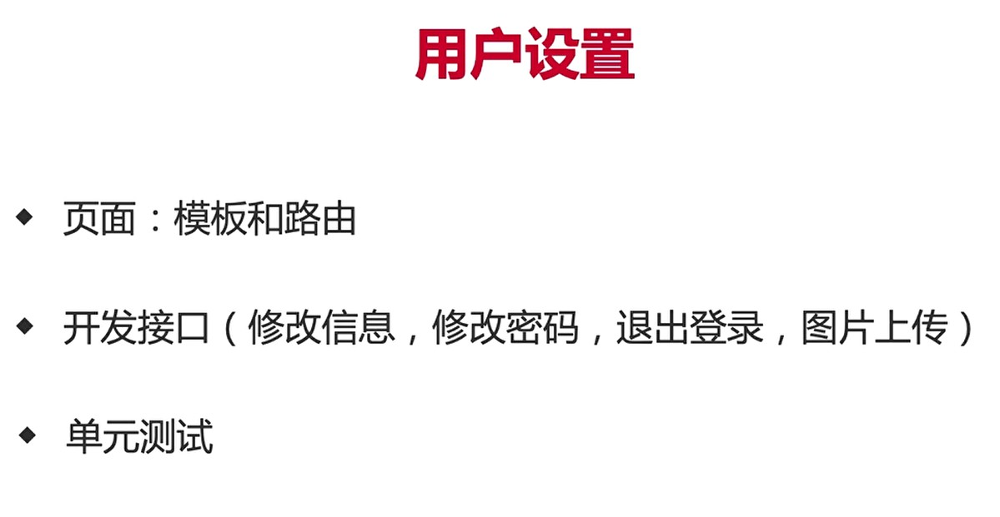

### 6.1 添加ejs页面和路由

src/views/setting.ejs

```
<%- include('layout/header', { title: '微博 - 设置', isNav: true })%>

<div class="container margin-top-20">
    <div class="row">
        <!-- 左侧 -->
        <div class="col-8">
            <h5 class="margin-bottom-10">基本信息</h5>
            <form>
                <div class="form-group row">
                    <label for="input-nick" class="col-sm-2 col-form-label">昵称</label>
                    <div class="col-sm-10">
                        <input type="text" class="form-control" id="input-nick" placeholder="请输入昵称" value="<%= nickName%>">
                    </div>
                </div>
                <div class="form-group row">
                    <label for="input-city" class="col-sm-2 col-form-label">城市</label>
                    <div class="col-sm-10">
                        <input type="text" class="form-control" id="input-city" placeholder="请输入城市" value="<%= city%>">
                    </div>
                </div>
                <div class="form-group row">
                    <label for="file-picture" class="col-sm-2 col-form-label">头像</label>
                    <div class="col-sm-10">
                        " style="width: 100px;" class="margin-bottom-10" id="img-picture"/>
                        <input type="file" class="form-control-file" accept="image/*" id="file-picture">
                    </div>
                </div>
                <center><button type="submit" class="btn btn-primary" id="btn-submit-info">保存</button></center>
            </form>

            <hr/>
            <h5 class="margin-bottom-10">修改密码</h5>
            <form>
                <div class="form-group row">
                    <label for="input-cur-password" class="col-sm-2 col-form-label">当前密码</label>
                    <div class="col-sm-10">
                        <input type="password" class="form-control" id="input-cur-password" placeholder="请输入当前密码">
                    </div>
                </div>
                <div class="form-group row">
                    <label for="input-new-password" class="col-sm-2 col-form-label">新密码</label>
                    <div class="col-sm-10">
                        <input type="password" class="form-control" id="input-new-password" placeholder="请输入新密码">
                    </div>
                </div>
                <div class="form-group row">
                    <label for="input-new-password-repeat" class="col-sm-2 col-form-label">确认密码</label>
                    <div class="col-sm-10">
                        <input type="password" class="form-control" id="input-new-password-repeat" placeholder="请输入确认密码">
                    </div>
                </div>
                <center><button type="submit" class="btn btn-primary" id="btn-submit-password">提交</button></center>
            </form>

            <hr/>
            <center><button class="btn btn-danger"  id="btn-logout">退出登录</button></center>

        </div> <!-- 左侧结束 -->

        <!-- 右侧 -->
        <div class="col-4">
        </div> <!-- 右侧结束 -->
    </div>
</div>

<script>
$(function() {
    // 上传图片
    var $imgPicture = $('#img-picture')
    var $filePicture = $('#file-picture')
    $filePicture.change(function (e) {
        var file = $filePicture[0].files[0]
        ajax.upload('/api/utils/upload', file, function(err, data) {
            if (err) {
                alert(err)
                return
            }
            // 成功
            $imgPicture.attr('src', data.url)
        })
    })

    // 修改基本信息
    var $inputNick = $('#input-nick')
    var $inputCity = $('#input-city')
    $('#btn-submit-info').click(function(e) {
        e.preventDefault()
        var nickName = $inputNick.val()
        var city = $inputCity.val()
        var picture = $imgPicture.attr('src')

        ajax.patch('/api/user/changeInfo', {
            nickName,
            city,
            picture
        }, function(err, data) {
            if (err) {
                alert(err)
                return
            }
            alert('修改成功')
        })
    })

    // 修改密码
    var $inputCurPassword = $('#input-cur-password')
    var $inputNewPassword = $('#input-new-password')
    var $inputNewPasswordRepeat = $('#input-new-password-repeat')
    $('#btn-submit-password').click(function(e) {
        e.preventDefault()
        var curPassword = $inputCurPassword.val()
        var newPassword = $inputNewPassword.val()
        var newPasswordRepeat = $inputNewPasswordRepeat.val()

        if (newPassword !== newPasswordRepeat) {
            alert('两次新密码输入不一致')
            return
        }
        if (curPassword === newPassword) {
            alert('新密码和当前密码一致')
            return
        }
        
        ajax.patch('/api/user/changePassword', {
            password: curPassword,
            newPassword: newPassword
        }, function(err, data) {
            if (err) {
                alert(err)
                return
            }
            alert('修改成功')
            $inputCurPassword.val('')
            $inputNewPassword.val('')
            $inputNewPasswordRepeat.val('')
        })
    })

    // 退出登录
    $('#btn-logout').click(function() {
        if (confirm('是否确定退出登录？') === false) {
            return
        }
        ajax.post('/api/user/logout', function(err, data) {
            if (err) {
                console.error(err)
                return
            }
            alert('已成功退出')
            location.href = '/login'
        })
    })
})
</script>

<%- include('layout/footer')%>
```

src/routes/view/user.js

```
router.get('/setting', loginRedirect, async (ctx, next) => {
    await ctx.render('setting', ctx.session.userInfo)
})
```

### 6.2 文件上传

(formidable-upload-koa、fs-extra)

#### 1.添加路由

src/routes/api/utils.js

```
/**
 * @description utils api 路由
 * @author 学浪
 */

const router = require('koa-router')()
const {loginCheck} = require('../../middlewares/loginChecks')
const koaForm = require('formidable-upload-koa')
const {saveFile} = require('../../controller/utils')


router.prefix('/api/utils')

router.post('/upload', loginCheck, koaForm(), async (ctx, next) => {
    // 获取参数
    const file = ctx.req.files['file']
    if (!file) return;
    const {size, path, name, type} = file

    // 返回结果
    ctx.body = await saveFile({
        name,
        type,
        size,
        filePath: path
    })
})

module.exports = router
```

#### 2.添加controller层

src/controller/utils.js

```
/**
 * @description utils controller
 * @author 学浪
 */

const path = require('path')
const {ErrorModel, SuccessModel} = require('../model/ResModel')
const {uploadFileSizeFailInfo} = require('../model/ErrorInfo')
const fse = require('fs-extra')

// 存储目录
const DIST_FOLDER_PATH = path.join(__dirname, '..', '..', 'uploadFiles')
// 文件最大体积 1M
const MIX_SIZE = 1024 * 1024 * 1024

// 是否需要创建目录
fse.pathExists(DIST_FOLDER_PATH).then(exist => {
    if (!exist) {
        fse.ensureDir(DIST_FOLDER_PATH)
    }
})

/**
 * 保存文件
 * @param {string} name 文件名
 * @param {string} type 文件类型
 * @param {number} size 文件体积大小
 * @param {string} filePath 文件路径
 */
async function saveFile({name, type, size, filePath}) {
    if (size > MIX_SIZE) {
        await fse.remove(filePath)
        return new ErrorModel(uploadFileSizeFailInfo)
    }

    // 移动文件
    const fileName = Date.now() + '.' + name // 防止重名
    const distFilePath = path.join(DIST_FOLDER_PATH, fileName) // 目的地
    await fse.move(filePath, distFilePath)

    // 返回信息
    return new SuccessModel({
        url: '/' + fileName
    })
}

module.exports = {
    saveFile
}
```

#### 3.添加静态资源文件夹

src/app.js

```
const path = require('path')
const koaStatic = require('koa-static')
const utilsAPIRouter = require('./routes/api/utils')

app.use(koaStatic(__dirname + '/public'))
app.use(koaStatic(path.join(__dirname, '..', 'uploadFiles')))

app.use(utilsAPIRouter.routes(), utilsAPIRouter.allowedMethods())
```

#### 4.统一文件服务

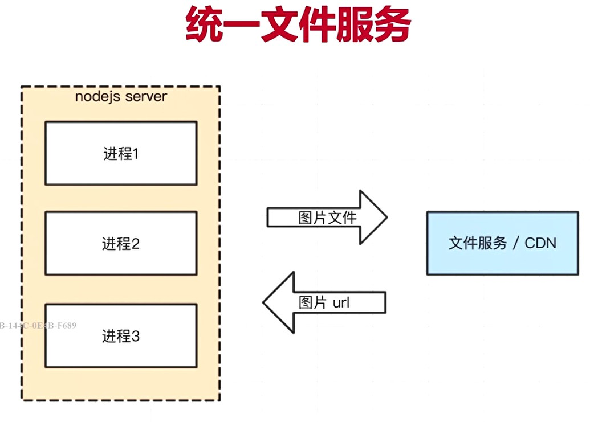

> 上线之后可能是一台机器多个node进程或集群(多个机器多个进程)  
> 多机器的同步就会有问题, 这时就需要一个统一文件服务  

### 6.3 修改基本信息

#### 1.添加路由

src/routes/api/user.js

```
// 修改个人信息
router.patch('/changeInfo', loginCheck, genValidator(userValidate), async (ctx, next) => {
    // 接收参数
    const { nickName, city, picture } = ctx.request.body
    // 返回结果
    ctx.body = await changeInfo(ctx, { nickName, city, picture })
})
```

#### 2.添加controller层

src/controller/user.js

```
/**
 * 修改用户信息
 * @param ctx ctx
 * @param nickName 昵称
 * @param city 城市
 * @param picture 头像
 */
async function changeInfo(ctx, { nickName, city, picture }) {
    // 业务逻辑处理
    const {userName} = ctx.session.userInfo
    if (!nickName) {
        nickName = userName
    }
    const result = await updateUser({
        newNickName: nickName,
        newCity: city,
        newPicture: picture
    }, {
        userName
    })

    // 统一返回格式
    if (result) {
        // 更新成功
        Object.assign(ctx.session.userInfo, {
            nickName,
            city,
            picture
        })
        return new SuccessModel()
    }
    return new ErrorModel(changeInfoFailInfo)
}
```

#### 3.添加services层

src/services/user.js

```
/**
 * 更新用户信息
 * @param newNickName 新昵称
 * @param newCity 新城市
 * @param newPicture 新头像
 * @param newPassword 新密码
 * @param userName 用户名
 * @param password 密码
 */
async function updateUser(
    { newNickName, newCity, newPicture, newPassword },
    {userName, password}
) {
    // 数据处理
    const updateData = {}
    if (newNickName) updateData.nickName = newNickName
    if (newCity) updateData.city = newCity
    if (newPicture) updateData.picture = newPicture
    if (newPassword) updateData.password = newPassword

    const whereOpt = { userName }
    if (password) whereOpt.password = password

    const result = await User.update(updateData, {
        where: whereOpt
    })

    // 格式化
    return result[0] > 0
}
```

### 6.4 修改密码

#### 1.添加路由

src/routes/api/user.js

```
// 修改密码
router.patch('/changePassword', loginCheck, genValidator(userValidate), async (ctx, next) => {
    // 接收参数
    const {password, newPassword} = ctx.request.body
    const {userName} = ctx.session.userInfo
    ctx.body = await changePassword(userName, password, newPassword)
})
```

#### 2.添加controller层

src/controller/user.js

```
/**
 * 修改密码
 * @param userName 用户名
 * @param password 密码
 * @param newPassword 新密码
 */
async function changePassword(userName, password, newPassword) {
    // 业务逻辑处理
    const result = await updateUser(
        {
            newPassword:　doCrypto(newPassword)
        },
        {
            userName,
            password: doCrypto(password)
        }
    )
    // 统一返回格式
    if (result) {
        // 成功
        return new SuccessModel()
    }
    // 失败
    return new ErrorModel(changePasswordFailInfo)
}
```

### 6.5 退出登录

#### 1.添加路由

src/routes/api/user.js

```
// 退出登录
router.post('/logout', loginCheck, async (ctx, next) => {
    ctx.body = await logout(ctx)
})
```

#### 2.添加controller层

src/controller/user.js

```
/**
 * 退出登录
 * @param {Object} ctx ctx
 */
async function logout(ctx) {
    delete ctx.session.userInfo
    return new SuccessModel()
}
```

### 6.6 单元测试

/test/user/login.test.js

```
// 登录
// ...

// 修改基本信息
test(' 修改基本信息，应该成功', async () => {
    const res = await server
        .patch('/api/user/changeInfo')
        .set('cookie', COOKIE)
        .send({
            nickName: '测试昵称',
            city: '测试城市',
            picture: '/test.png'
        })
    expect(res.body.errno).toBe(0)
})

// 修改密码
test(' 修改密码，应该成功', async () => {
    const res = await server
        .patch('/api/user/changePassword')
        .set('cookie', COOKIE)
        .send({
            password,
            newPassword: `p_${Date.now()}`
        })
    expect(res.body.errno).toBe(0)
})

// 删除
// ...

// 退出
test('退出登录, 应该成功', async () => {
    const res = await server
        .post('/api/user/logout')
        .set('cookie', COOKIE)
    expect(res.body.errno).toBe(0)
})
```


## 第7讲: 创建微博


### 7.1 创建blog模型

src/db/model/Blog.js

```
/**
 * @description 模型 blog表
 * @author 学浪
 */

const seq = require('../seq')
const {STRING, INTEGER, TEXT} = require('../types')

const Blog = seq.define('blog', {
    // 自动创建: id, 并设为主键、自增
    // 自动创建: createAt 和 updateAt
    userId: {
        type: INTEGER, // varchar(255)
        allowNull: false,
        comment: '用户id'
    },
    content: {
        type: TEXT, // TEXT
        allowNull: false,
        comment: '内容'
    },
    image: {
        type: STRING, // varchar(255),
        comment: '图片'
    },
})

module.exports = Blog
```

src/db/model/index.js

```
const User = require('./User')
const Blog = require('./Blog')

Blog.belongsTo(User, {
    foreignKey: 'userId'
})

module.exports = {
    User,
    Blog
}
```

### 7.2 ejs页面和路由


#### 1.ejs页面

src/views/index.ejs

```
<%- include('layout/header', { title: '微博 - 首页', isNav: true, list: true, isInputBlog: true })%>

<div class="container margin-top-20">
    <div class="row">
        <!-- 左侧 -->
        <div class="col-8">
            <!-- 输入框 -->
            <%- include('widgets/input')%>
        </div> <!-- 左侧结束 -->

        <!-- 右侧 -->
        <div class="col-4">
          
        </div> <!-- 右侧结束 -->
    </div>
</div>

<%- include('layout/footer')%>
```

src/views/widgets/blog-list.ejs

```
<% blogList.forEach(blog => { %>
    <div class="item-wrapper">
        "/>
        <div class="content clear-fix">
            <% if (blog.image) { %>
            <a href="<%= blog.image%>" target="_blank">
                "/>
            </a>
            <% } %>
            <a href="/profile/<%= blog.user.userName%>">
                <%= blog.user.nickName%>
            </a>:
            <span><%- blog.contentFormat%></span>
        </div>
        <div class="info">
            <span><%= blog.createdAtFormat%></span>
            &nbsp;
            <% if (locals.canReply) { %>
            <%# 可以回复 %>
            <a href="#" class="blog-list-reply"
                data-content="<%= blog.content%>"
                data-userName="<%= blog.user.userName%>"
                data-nickName="<%= blog.user.nickName%>"
            >
                <i class="fa fa-mail-reply"></i> 回复
            </a>
            <% } %>
        </div>
    </div>
<% }) %>

<script>
$(function () {
    // 设置焦点
    function setCursor(el, st, end) {
        if (el.setSelectionRange) {
            el.focus()
            el.setSelectionRange(st, end)
        } else if (el.createTextRange) {
            var range = el.createTextRange()
            range.collapse(true)
            range.moveEnd('character',end)
            range.moveStart('character',st)
            range.select()
        }
    }

    // 回复
    var $textContent = $('#text-content')
    $('.blog-list-reply').click(function (e) {
        e.preventDefault()
        var $target = $(e.target)

        // 获取内容和用户
        var content = $target.attr('data-content')
        var userName = $target.attr('data-userName')
        var nickName = $target.attr('data-nickName')

        // 设置内容并获取焦点
        $textContent.val(' // @' + nickName + ' - ' + userName + ' : ' + content)
        setCursor($textContent[0], 0, 0)
    })
})
</script>
```

src/views/widgets/followers.ejs

```
<div class="user-list right-item">
    <p class="title bold">
        <i class="fa fa-users"></i>
        关注（<%= count%>）
    </p>
    <div class="user-list clear-fix">
        <% userList.forEach(user => { %>
            <a href="/profile/<%= user.userName%>" class="user-item float-left">
                "/>
                <span><%= user.nickName%></span>
            </a>
        <% }) %>
    </div>
</div>
```

src/views/widgets/fans.ejs

```
<div class="user-list right-item">
    <p class="title bold">
        <i class="fa fa-users"></i>
        粉丝（<%= count%>）
    </p>
    <div class="user-list clear-fix">
        <% userList.forEach(user => { %>
            <a href="/profile/<%= user.userName%>" class="user-item float-left">
                "/>
                <span><%= user.nickName%></span>
            </a>
        <% }) %>
    </div>
</div>
```

src/views/widgets/user-info.ejs

```
<div class="user-info clear-fix">
    " class="header-img float-left"/>
    <h4 class="user-name"><%= userInfo.nickName%></h4>
</div>

<% if (isMe) { %>
    <%# 是当前登录用户%>
    <p class="bold margin-top-10">
        <a href="/at-me">
            @提到我的 (<%= locals.atCount%>)
        </a>
    </p>
<% } else { %>
    <%# 不是当前登录用户%>
    <p class="margin-top-10">
        <button id="btn-un-follow" class="btn btn-light" style="display: none;">取消关注</button>
        <button id="btn-follow" class="btn btn-primary" style="display: none;">关注</button>
    </p>
<% } %>

<script>
$(function () {
    // 当前用户 id
    var curUserId = <%= userInfo.id%> ;

    // 按钮，显示和隐藏
    var $btnFollow = $('#btn-follow')
    var $btnUnFollow = $('#btn-un-follow')
    if (<%= !isMe%>) {
        // 不是当前用户，则显示“关注”或者“取消关注”
        if (<%= locals.amIFollowed%>) {
            $btnUnFollow.show()
        } else {
            $btnFollow.show()
        }
    }

    // 关注此人
    $btnFollow.click(function () {
        ajax.post('/api/profile/follow', {
            userId: curUserId
        }, function (err) {
            if (err) {
                alert(err)
                return
            }
            // 关注成功
            $btnFollow.hide()
            $btnUnFollow.show()
        })
    })

    // 取消关注
    $btnUnFollow.click(function () {
        if (confirm('确定取消关注？') === false) {
            return
        }
        ajax.post('/api/profile/unFollow', {
            userId: curUserId
        }, function (err) {
            if (err) {
                alert(err)
                return
            }
            // 取消成功
            $btnFollow.show()
            $btnUnFollow.hide()
        })
    })
})
</script>
```

src/views/widgets/load-more.ejs

```
<div class="margin-bottom-20 ">
    <button id="btn-load-more" type="button" class="btn btn-sm btn-lg btn-block">点击加载更多</button>
</div>

<script>
    var PAGE_SIZE = <%= pageSize%>
    var PAGE_INDEX =  <%= pageIndex%>
    var COUNT =  <%= count%>
    var $btnLoadMore = $('#btn-load-more')
    var $containerWeiboList = $('<%= containerSelector%>')
    var api = '<%= api%>'

    // 加载更多
    $btnLoadMore.click(function () {
        var nextPageIndex = PAGE_INDEX + 1
        ajax.get(api + '/' + nextPageIndex, function(err, data) {
            if (err) {
                // 失败
                alert(err)
                return
            }
            // 更新 pageIndex
            PAGE_INDEX = data.pageIndex

            // 是否要隐藏“加载更多”
            if ((PAGE_INDEX + 1) * PAGE_SIZE >= COUNT) {
                $btnLoadMore.hide()
            }

            // 渲染页面
            var $tempContainer = $(data.blogListTpl)
            $tempContainer.each(function (index, item) {
                if (item.nodeType !== 1) {
                    // 不是 DOM 元素，是其他（如 #TEXT 类型）
                    return
                }
                $containerWeiboList.append($(item))
            })
        })
    })
</script>
```

src/views/widgets/input.ejs

```
<!-- 微博输入框 -->
<div class="margin-bottom-10 padding-bottom-10 border-bottom">
    <textarea class="form-control" id="text-content" rows="3"></textarea>
    <div class="margin-top-10">
        <button class="btn btn-primary" id="btn-submit">发表</button>
        &nbsp;
        <a href="#" id="btn-add-img">
            <i class="fa fa-picture-o"></i>
            插入一张图片
        </a>
        <input type="file" accept="image/*" id="file-picture" style="display: none;">
        <input type="hidden" id="input-img-url">
        &nbsp;
        <span id="span-img-name"></span>
    </div>
</div>

<script>
$(function () {
    var $spanImgName = $('#span-img-name')
    var $inputImgUrl = $('#input-img-url')
    var $textContent = $('#text-content')
    var $filePicture = $('#file-picture')

    // 上传图片
    $filePicture.change(function (e) {
        var file = $filePicture[0].files[0]
        $spanImgName.text(file.name)
        ajax.upload('/api/utils/upload', file, function(err, data) {
            if (err) {
                alert(err)
                return
            }
            // 成功
            $inputImgUrl.val(data.url)
        })
    })

    // 插入图片
    $('#btn-add-img').click(function (e) {
        e.preventDefault()
        //  开始选择图片
        $filePicture.click()
    })

    // 发布微博
    $('#btn-submit').click(function () {
        var content = $textContent.val().trim()
        var imgUrl = $inputImgUrl.val() || ''

        // 验证
        if (content.length === 0) {
            alert('请输入微博内容')
            return
        }

        // 发布
        ajax.post('/api/blog/create', {
            content: content,
            image: imgUrl
        }, function (err) {
            if (err) {
                // 失败
                alert(err)
                return
            }
            // 成功
            $filePicture.val('')
            $spanImgName.text('')
            $textContent.val('')
            $inputImgUrl.val('')

            // 刷新页面
            location.href = location.pathname
        })
    })

    // @ 功能
    $textContent.atwho({
        at: '@',
        data: '/api/user/getAtList'
        // data: ['Peter', 'Tom', 'Anne']
    })
})
</script>
```

#### 2.路由

src/routes/view/blog.js

```
const router = require('koa-router')()
const {loginRedirect} = require('../../middlewares/loginChecks')

router.post('/', loginRedirect, async (ctx, next) => {
    await ctx.render('index', {})
})

module.exports = router
```

src/app.js

```
const blogViewRouter = require('./routes/view/blog')

app.use(blogViewRouter.routes(), blogViewRouter.allowedMethods())
```

### 7.3 开发接口

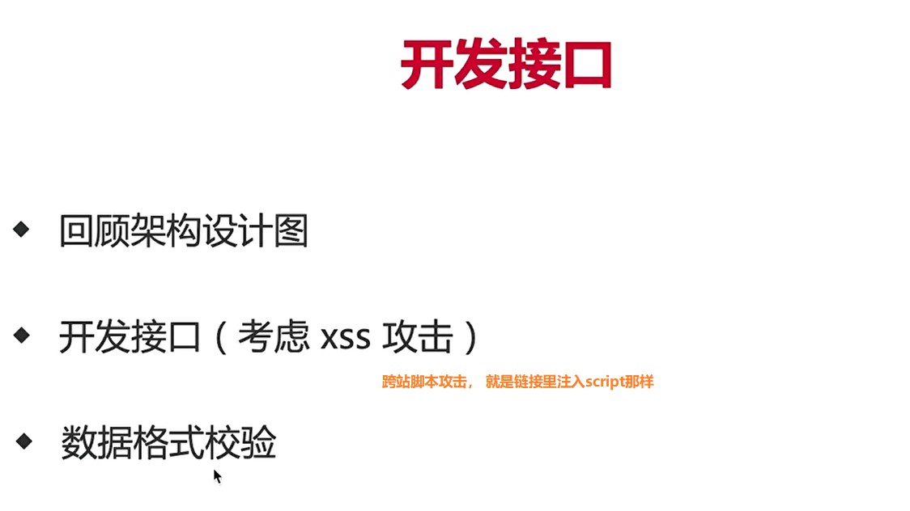

#### 1.创建微博API

src/routes/api/blog-home.js

```
/**
 * @description 首页API
 * @author 学浪
 */

const router = require('koa-router')();
const {loginCheck} = require('../../middlewares/loginChecks')
const {create} = require('../../controller/blog-home')

router.prefix('/api/blog')

// 创建博客
router.post('/create', loginCheck, async (ctx, next) => {
    // 接收参数
    const {content, image} = ctx.request.body
    const {id: userId} = ctx.session.userInfo
    // 返回结果
    ctx.body = await create({userId, content, image})
})

module.exports = router
```

src/controller/blog-home.js

```
/**
 * @description 首页 Controller
 * @author 学浪
 */

const {createBlog} = require('../services/blog')
const {SuccessModel, ErrorModel} = require('../model/ResModel')
const {createBlogFailInfo} = require('../model/ErrorInfo')

/**
 * 创建微博
 * @param {Object} param0 创建微博所需的数据 { userId, content, image }
 */
async function create({userId, content, image}) {
    try {
        const blog = await createBlog({
            userId,
            content,
            image
        })
        return new SuccessModel(blog)
    } catch (err) {
        console.log(err.message, err.stack)
        return new ErrorModel(createBlogFailInfo)
    }
}

module.exports = {
    create
}
```

src/services/blog.js

```
/**
 * @description 首页 Service
 * @author 学浪
 */

const {Blog} = require('../db/model')

/**
 * 创建微博
 * @param {Object} param0 创建微博所需的数据 { userId, content, image }
 */
async function createBlog({userId, content, image}) {
    const result = await Blog.create({
        userId,
        content,
        image
    })
    return result.dataValues
}

module.exports = {
    createBlog
}
```

src/app.js

```
const blogHomeViewRouter = require('./routes/api/blog-home')

app.use(blogHomeViewRouter.routes(), blogHomeViewRouter.allowedMethods())
```

#### 2.xss过滤和格式校验

##### xss过滤

src/controller/blog-home.js

```
const xss = require('xss')


const blog = await createBlog({
    userId,
+    content: xss(content),
    image
})
```

##### 格式校验

src/validator/blog.js

```
/**
 * @description blog 数据格式验证
 * @author 学浪
 */

const _validate = require('./_validate')

// 校验规则
const SCHEMA = {
    type: 'object',
    properties: {
        content: {
            type: 'string'
        },
        image: {
            type: 'string',
            maxLength: 255,
        }
    }
}

function blogValidate(data = {}) {
    return _validate(SCHEMA, data)
}

module.exports = blogValidate
```

src/routes/api/blog-home.js

```
+ const blogValidate = require('../../validator/blog')
+ const {genValidator} = require('../../middlewares/validator')

+ router.post('/create', loginCheck, genValidator(blogValidate), async (ctx, next) => {
```


## 第99讲: 坑

#### 1. Client does not support authentication protocol requested by server

```
npm i mysql 改为 npm i mysql2
```


- 1
- 1
- 1
- 1
- 1
- 1
- 1
- 1
- 1
- 1
- 1
- 1
- 1
- 1
- 1
- 1
- 1
- 1
- 1
- 1
- 1
- 1
- 1
- 1
  
- 1
- 1
- 1
- 1
- 1
- 1
- 1
- 1
- 1
- 1
- 1
- 1
- 1
- 1
- 1
- 1
- 1
- 1
- 1
- 1
- 1
- 1
- 1


