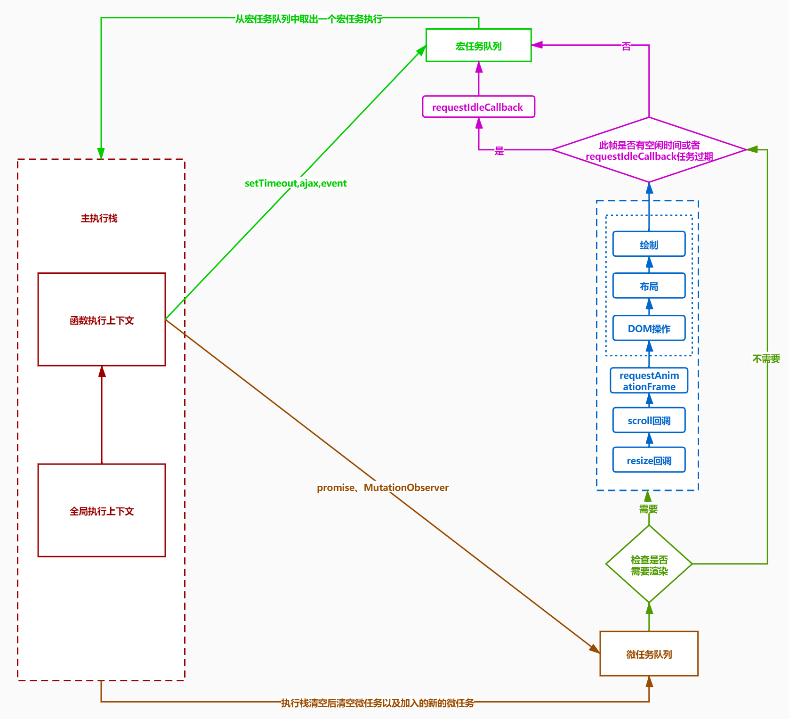

http://zhufengpeixun.com/strong/html/106.2.react_hooks.html#t01.%20React%20Hooks

### 1. React Hooks

- Hook 是 React 16.8 的新增特性。它可以让你在不编写 class 的情况下使用 state 以及其他的 React 特性
- 如果你在编写函数组件并意识到需要向其添加一些 state，以前的做法是必须将其它转化为 class。现在你可以在现有的函数组件中使用 Hook

### 2. 解决的问题

- 在组件之间复用状态逻辑很难,可能要用到render props和高阶组件，React 需要为共享状态逻辑提供更好的原生途径，Hook 使你在无需修改组件结构的情况下复用状态逻辑
- 复杂组件变得难以理解，Hook 将组件中相互关联的部分拆分成更小的函数（比如设置订阅或请求数据）
- 难以理解的 class,包括难以捉摸的this

### 3. 注意事项

- 只能在函数最外层调用 Hook。不要在循环、条件判断或者子函数中调用。
- 只能在 React 的函数组件中调用 Hook。不要在其他 JavaScript 函数中调用

### 4. useState

- 不能在if和for循环里面使用, 因为是用数组索引存储, 所以可能导致混乱!!!

- useState 就是一个 Hook
- 通过在函数组件里调用它来给组件添加一些内部 state,React 会在重复渲染时保留这个 state
- useState 会返回一对值：当前状态和一个让你更新它的函数，你可以在事件处理函数中或其他一些地方调用这个函数。它类似 class 组件的 this.setState，但是它不会把新的 state 和旧的 state 进行合并
- useState 唯一的参数就是初始 state
- 返回一个 state，以及更新 state 的函数
    - 在初始渲染期间，返回的状态 (state) 与传入的第一个参数 (initialState) 值相同
    - setState 函数用于更新 state。它接收一个新的 state 值并将组件的一次重新渲染加入队列
    
```
import React from 'react'
import ReactDOM from 'react-dom'
function Counter(props) {
    let [number, setNumber] = React.useState(0)
    let handleClick = () => setNumber(number + 1)
    return (
        <div>
            <p>{number}</p>
            <button onClick={handleClick}>+</button>
        </div>
    )
}
ReactDOM.render(<Counter />, document.getElementById('root'))
```

### 5. useCallback+useMemo

- 把内联回调函数及依赖项数组作为参数传入 useCallback，它将返回该回调函数的 memoized 版本，该回调函数仅在某个依赖项改变时才会更新
- 把创建函数和依赖项数组作为参数传入 useMemo，它仅会在某个依赖项改变时才重新计算 memoized 值。这种优化有助于避免在每次渲染时都进行高开销的计算

```
import React from 'react';
import ReactDOM from 'react-dom';

let  Child = ({data,handleClick})=>{
  console.log('Child render');
  return (
     <button onClick={handleClick}>{data.number}</button>
  )
}
Child = React.memo(Child);

function App(){
  console.log('App render');
  const[name,setName]=React.useState('zhufeng');
  const[number,setNumber]=React.useState(0);
  let data = React.useMemo(()=>({number}),[number]);
  let handleClick = React.useCallback(()=> setNumber(number+1),[number]);
  return (
    <div>
      <input type="text" value={name} onChange={event=>setName(event.target.value)}/>
      <Child data={data} handleClick={handleClick}/>
    </div>
  )
}

ReactDOM.render(
  <App />,
  document.getElementById('root')
);
```

### 6. useReducer

- useState 的替代方案。它接收一个形如 (state, action) => newState 的 reducer，并返回当前的 state 以及与其配套的 dispatch 方法
- 在某些场景下，useReducer 会比 useState 更适用，例如 state 逻辑较复杂且包含多个子值，或者下一个 state 依赖于之前的 state 等

```
import React from './react';
import ReactDOM from './react-dom';
function reducer(state={number:0}, action) {
  switch (action.type) {
    case 'ADD':
      return {number: state.number + 1};
    case 'MINUS':
      return {number: state.number - 1};
    default:
      return state;
  }
}

function Counter(){
    const [state, dispatch] = React.useReducer(reducer,{number:0});
    return (
        <div>
          Count: {state.number}
          <button onClick={() => dispatch({type: 'ADD'})}>+</button>
          <button onClick={() => dispatch({type: 'MINUS'})}>-</button>
        </div>
    )
}
ReactDOM.render(<Counter/>, document.getElementById('root'));
```

### 7.useContext

- 接收一个 context 对象（React.createContext 的返回值）并返回该 context 的当前值
- 当前的 context 值由上层组件中距离当前组件最近的 <MyContext.Provider> 的 value prop 决定
- 当组件上层最近的 <MyContext.Provider> 更新时，该 Hook 会触发重渲染，并使用最新传递给 MyContext provider 的 context value 值
- useContext(MyContext) 相当于 class 组件中的 static contextType = MyContext 或者 <MyContext.Consumer>
- useContext(MyContext) 只是让你能够读取 context 的值以及订阅 context 的变化。你仍然需要在上层组件树中使用 <MyContext.Provider> 来为下层组件提供 context

```
import React from './react';
import ReactDOM from './react-dom';

const CounterContext = React.createContext();

function reducer(state, action) {
  switch (action.type) {
    case 'add':
      return {number: state.number + 1};
    case 'minus':
      return {number: state.number - 1};
    default:
      return state;
  }
}
function Counter(){
  let {state,dispatch} = React.useContext(CounterContext);
  return (
      <div>
        <p>{state.number}</p>
        <button onClick={() => dispatch({type: 'add'})}>+</button>
        <button onClick={() => dispatch({type: 'minus'})}>-</button>
      </div>
  )
}
function App(){
    const [state, dispatch] = React.useReducer(reducer, {number:0});
    return (
        <CounterContext.Provider value={{state,dispatch}}>
          <Counter/>
        </CounterContext.Provider>
    )
}

ReactDOM.render(<App/>,document.getElementById('root'));
```

### 8.useEffect

- 在函数组件主体内（这里指在 React 渲染阶段）改变 DOM、添加订阅、设置定时器、记录日志以及执行其他包含副作用的操作都是不被允许的，因为这可能会产生莫名其妙的 bug 并破坏 UI 的一致性
- 使用 useEffect 完成副作用操作。赋值给 useEffect 的函数会在组件渲染到屏幕之后执行。你可以把 effect 看作从 React 的纯函数式世界通往命令式世界的逃生通道
- useEffect 就是一个 Effect Hook，给函数组件增加了操作副作用的能力。它跟 class 组件中的 `componentDidMount`、`componentDidUpdate` 和 `componentWillUnmount` 具有相同的用途，只不过被合并成了一个 API
- 该 Hook 接收一个包含命令式、且可能有副作用代码的函数

```
function Counter() {
    console.log(`Counter render`)
    const [number, setNumber] = React.useState(0);
    // useEffect里的函数会在当前组件渲染到页面之后执行(类似componentDidMount)
    // 每次执行useEffect里的函数前,先会执行上次useEffect的返回值
    React.useEffect(() => {
        console.log('开启一个新的定时器')
        const $timer = setInterval(() => {
            setNumber(number => number + 1);
        }, 1000);
        return () => {
            console.log('销毁老的定时器');
            clearInterval($timer);
        }
    });
    return (
        <p>{number}</p>
    )
}

ReactDOM.render(<Counter/>, document.getElementById('root'));
```

### 9.useLayoutEffect+useRef

- 其函数签名与 `useEffect` 相同，但它会在所有的 DOM 变更之后同步调用 effect
- `useEffect` 不会阻塞浏览器渲染，而 `useLayoutEffect` 会浏览器渲染
- `useEffect` 会在浏览器渲染结束后执行, `useLayoutEffect` 则是在 DOM 更新完成后,浏览器绘制之前执行

#### 9.1 事件循环



#### 9.2 基本使用

```
import React from './react';
import ReactDOM from './react-dom';

const Animate = ()=>{
    const ref = React.useRef();
    React.useLayoutEffect(() => {
      ref.current.style.transform = `translate(500px)`;//TODO
      ref.current.style.transition = `all 500ms`;
    });
    let style = {
      width: '100px',
      height: '100px',
      borderRadius: '50%',
      backgroundColor: 'red'
    }
    return (
      <div style={style} ref={ref}></div>
    )
}
ReactDOM.render(<Animate/>,document.getElementById('root'));
```

#### 9.3 实现: src\react-dom.js

```
+export function useLayoutEffect(callback,dependencies){
+    let currentIndex = hookIndex;
+    if(hookStates[hookIndex]){
+        let [destroy,lastDeps] = hookStates[hookIndex];
+        let same = dependencies&&dependencies.every((item,index)=>item === lastDeps[index]);
+        if(same){
+          hookIndex++;
+        }else{
+          destroy&&destroy();
+          queueMicrotask(()=>{
+              hookStates[currentIndex]=[callback(),dependencies];
+          });
+          hookIndex++
+        }
+    }else{
+      queueMicrotask(()=>{
+          hookStates[currentIndex]=[callback(),dependencies];
+      });
+       hookIndex++;
+    }
+}
+export function useRef(initialState) {
+    hookStates[hookIndex] =  hookStates[hookIndex] || { current: initialState };
+    return hookStates[hookIndex++];
+}
```

#### 9.4 实现: src\react.js

```
import {wrapToVdom} from './utils';
import {Component,PureComponent} from './Component';
+import {useState,useMemo,useCallback,useReducer,useEffect,useRef,useLayoutEffect} from './react-dom';
const React = {
    createElement,
    Component,
    PureComponent,
    createRef,
    createContext,
    cloneElement,
    memo,
    useMemo,
    useCallback,
    useState,
    useReducer,
    useContext,
    useEffect,
    useRef,
+   useLayoutEffect
};
export default React;
```

### 10. forwardRef+useImperativeHandle

- forwardRef将ref从父组件中转发到子组件中的dom元素上,子组件接受props和ref作为参数
- useImperativeHandle 可以让你在使用 ref 时自定义暴露给父组件的实例值

```
import React from './react';
import ReactDOM from './react-dom';

function Child(props, ref) {
    const inputRef = React.useRef();
    // 定制暴露给父组件的ref值, 这里仅让外界调focus1方法
    React.useImperativeHandle(ref, () => (
        {
            focus() {
                inputRef.current.focus();
            }
        }
    ));
    return (
        <input type="text" ref={inputRef} />
    )
}
const ForwardChild = React.forwardRef(Child);
function Parent() {
    let [number, setNumber] = React.useState(0);
    const inputRef = React.useRef();
    function getFocus() {
        console.log(inputRef.current);
        inputRef.current.value = 'focus';
        inputRef.current.focus();
    }
    return (
        <div>
            <ForwardChild ref={inputRef} />
            <button onClick={getFocus}>获得焦点</button>
            <p>{number}</p>
            <button onClick={() => {
                debugger
                setNumber( number + 1)
            }}>+</button>
        </div>
    )
}
ReactDOM.render(<Parent/>,document.getElementById('root'));
```